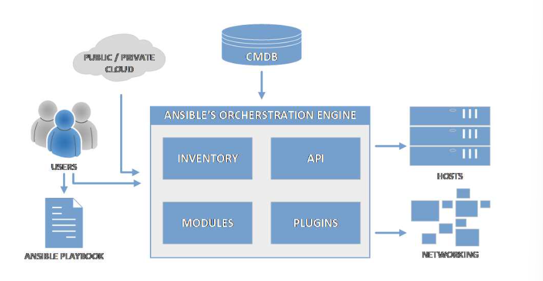

# syllabus

1. Introduction

2. High-level View

3. Environment setup

4. Installing Ansible

5. Ansible Configuration

6. Ansible Inventory

7. Connecting to Remote Environment

8. Running Adhoc Commands

9. Ansible Playbook

10. Ansible Playbook Handlers

11. Templating

12. Ansible Vault Data Encryption

13. Ansible Runtime facts

14. Ansible Tags

15. Ansible Roles

16. Ansible Galaxy


## 1. Introduction

- Ansible is an open-source software, automation engine, and automation language mainly used in software configuration management, infrastructure provisioning, configuration management, application deployment, and orchestration. The ansible automation engine executes the playbooks.

The main qualities of ansible are :
1. Simple
2. Powerful
3. Agentless

Ansible, initially created in 2012 was acquired by Redhat in 2015

**why do we need Ansible ?**

- Being a software developer or system administrator, we aware how challenging is to keep the application deployment and server's management efficient and reliable.

In simple terms, everything is more complex, bigger and faster.

This is why configuration management tools such as Ansible, chef, puppet and saltstack came to thrive as solutions for these internet age problems.

**What can Ansible be used for ?**
- Ansible has a wide range of usages. like

1. Infrastructure provisioning : Infrastructure provisioning is the process of setting up the IT infrastructures, which refers to the components, hardware and software needed to operate an application service or system. Bear in mind that provisioning is not the same as configuration. But both are steps in the deployment process

2. Configuration Management : configuration management is the process of maintaining infrastructure and software in a desired and consistent state. It's way to make sure that a system performs as expected as changes made over time.

- The great benefit of automating and having the configuration management processes in place is that it makes the deployments faster, removes the possibility of the human errors and manages the system in a predictable and stable state.

3. Application deployment : With ansible, teams are able to manage the entire application lifecycle effectively from development to production. Ansible offers a simple way to deploy your multitier application in a reliable and consistent way.

4. Orchestration : Ansible provides orchestration in the sense of aligning the business request with applications, data and infrastructure.


## 2. High-level View

**Architecture**



Users: Users are simply the developers, operators, and Devops Practitioners who are writing or executing the automation scripts.

Modules: Units of code ansible executes . These are executed directly on remote hosts through playbooks or by running them individually from command line.

EX: file, stat, copy, shell, service, yum, git etc

Plugins : Plugins are extensions of the ansible runtime. Operations such as data transformation, logging of the output, and inventory handling are plugins. Plugins are often working in conjunction with modules.

Inventories: Inventory is a file, defined in yaml or ini format. Ansible works against multiple managed nodes or hosts that are part of the infrastructure, and the list of those items is also known as the inventory.

Ansible Playbooks: Playbooks are files (scripts) that combine configuration, deployment, and orchestration functions. playbooks are executed to provide a way of automating the remote systems in a consistent and repeatable manner.


## 3. Environment setup

Tools required : vagrant, git, virtual box, vscode

```
vagrant -v
vagrant plugin install vagrant-hostmanager
vagrant plugin list
```

```
code --install-extension marcostazi.vs-code-vagrantfile  
code --install-extension wholroyd.jinja 
code --install-extension haaaad.ansible 
code --install-extension ms-vscode-remote.remote-ssh  
code --install-extension ms-vscode-remote.remote-ssh-edit
code --install-extension ms-vscode-remote.vscode-remote-extensionpack
code --install-extension sysninja.vscode-ansible-mod

```

``` vagrant file
# -*- mode: ruby -*-
# vi: set ft=ruby :
BOX_IMAGE = "Dougs71/CentOS-8.1.1911"
BOX_VERSION = "1.0.0"
Vagrant.configure("2") do |config|
  config.hostmanager.enabled = true
  config.hostmanager.manage_host = false
  #Ansible manager definition
  config.vm.define "amgr" do |amgr|
    amgr.vm.box = BOX_IMAGE
    amgr.vm.box_version = BOX_VERSION
    amgr.vm.hostname = 'amgr'
    amgr.vm.network :private_network, ip: "192.168.3.100"
    amgr.vm.provider :virtualbox do |v|
      v.memory = 2048
      v.cpus = 4
      v.name = "amgr"
    v.customize ["modifyvm", :id, "--natdnshostresolver1", "on"]
    end
  end
  #Load balancer definition
  config.vm.define "lb" do |lb|
    lb.vm.box = BOX_IMAGE
    lb.vm.box_version = BOX_VERSION
    lb.vm.hostname = 'lb'
    lb.vm.network :private_network, ip: "192.168.3.200"
    lb.vm.provider :virtualbox do |v|
      v.memory = 1024
      v.cpus = 1
      v.name = "lb"
    end
  end
  #Database definition
  config.vm.define "db" do |db|
    db.vm.box = BOX_IMAGE
    db.vm.box_version = BOX_VERSION
    db.vm.hostname = 'db'
    db.vm.network :private_network, ip: "192.168.3.199"
    db.vm.provider :virtualbox do |v|
      v.memory = 1024
      v.name = "db"
    end
  end
  #Creation of the web application servers
  (160..161).each do |host|
    config.vm.define "web#{host}" do |web|
      web.vm.box = BOX_IMAGE
      web.vm.box_version = BOX_VERSION
      web.vm.hostname = 'web#{host}'
      web.vm.network :private_network, ip: "192.168.3.#{host}"
      web.vm.hostname = "web#{host}"
      web.vm.provider :virtualbox do |v|
        v.memory = 1024
        v.cpus = 1
        v.name = "web#{host}"
      end
    end
  end
end


```
`vagrant up` to up the newly created VMs. `vagrant status` to view on the status of the VMs.

|Command| Description|
| --- | --- |
|vagrant up | Given the presence of a Vagrantfile with the infrastructure definition, creates or starts the infrastructure. Use this command every time you want to start the VMs. |
| vagrant destroy | It can only be executed in the folder where the Vagrantfile is located. It destroys the VMs created, by literally deleting all of the files and configuration. |
| vagrant reload | Reloads the virtual machine by applying new settings from the Vagrantfile. Useful when you need to change network or synced folder settings. |
| vagrant ssh | It connects to a running Vagrant VM. |
|vagrant halt | Stops (pauses) the virtual machine.|
|vagrant ssh <machine name> | To access any machine created by vagrant |
| ssh vagrant@<machine-ip> | To access machine |

## 4. Installing Ansible

There are two ways to install and use ansible on the host.

```
- Using the operating system package manager (apt-get, yum), depending on the operating system in use.

- Install Ansible by using pip, which is the Python package manager.
```

`sudo yum install ansible` - To installl ansible

`ansible --version`- To check ansible version

```bash
sudo dnf install python3 -y #to install pip
# create virtual environment
mkdir ansible
cd ansible
python3 -m venv avenv
source avenv/bin/activate

pip3 install --upgrade pip setuptools wheel

pip3 install ansible

pip3 list --outdated # check for new version

pip3 install -U ansible #update ansible command

```

## 5. Ansible Configuration
- Certain settings in ansible are adjustable via configuration file (ansible.cfg). This file contains all of the ansible configuration

`ansible --version` -> ansible.cfg location

- Ansible will look at the configuration file in a variety of locations, with the following priority, and use the first file found (all others are ignored)

|Name | Description|
| --- | --- |
|ANSIBLE_CONFIG | If there is an environment variable ANSIBLE_CONFIG set up to point to any file on the file system.
<br>
In the ANSIBLE_CONFIG we can specify the file location directly anywhere in the system before running Ansible, for example:
export ANSIBLE_CONFIG=/path_to_file/ansible.cfg |
| ./ansible.cfg | The . represents the current directory.|
| ~/.ansible.cfg | ~ is a shortcut for the user’s home directory. In our case, this would be the vagrant user under its home directory. /home/vagrant.|
| /etc/ansible/ansible.cfg | File in a system location, globally defined.|

`ansible-config list` -> To check current ansible configuration

`ansible-config view` -> To display the current config file

`ansible-config dump --only-changed` -> To show only the values that we have potentially overridden, which are different from the default one

`ansible.cfg configuration sections`

|||
|---|---|
|[defaults]| Default generic Ansible settings.|
|[inventory]| Dynamic inventory plugin settings.|
|[privilege_escalation]| Ansible can use existing privilege escalation systems to allow a user to execute tasks as another user.|
|[paramiko_connection]| Paramiko is the default SSH connection implementation on Enterprise Linux 6 or earlier and is not used by default on other platforms.|
|[ssh_connection]| OpenSSH specific settings.|
|[persistent_connection] | When communicating with a remote device, you have control over how long Ansible maintains the connection to that device, as well as how long Ansible waits for a command to complete on that device.|
|[sudo_become_plugin] | User to be used as the sudo. |
| [colors] | Colors in the editor when running commands.|
|[galaxy] | Galaxy platform-specific settings.|


## 6. Ansible Inventory

- The inventory or host configuration file is a file that defines the hosts or groups of hosts upon which commands, modules, and tasks in an ansible playbook will operate. In other words, It defines a list of systems that we wish to manage with ansible.

- Typically this file is located in /etc/ansible directory if ansible is installed with the default linux package manager.

- Some important facts about inventory file

```
- Inventory file defines a collection of hosts that are target systems of automation
- The inventory file contains a list of hosts that can be grouped together into groups. one host can be part of multiple groups. For ex, we could group hosts into webservers, databases, loadbalancers and so on
- Groups can be grouped together and managed collectively
- The inventory file contains variables that could apply to either hosts or groups
- The inventory file is a file that can be written in INI style or YAML style formats
- It is possible to create an inventory file in dynamic way too.
```

- There are two groups that are defined by default in ansible.

All: contains every host as defined in the inventory file
ungrouped : contains all hosts that don't have another group defined (aside from all)

This implies that every host will belong to at least one of the two groups.

Nested groups :

```
[italy]
web1.domain.It
web2.domain.it
[switzerland]
web1.domain.ch
[europe:children]
italy 
switzerland
```

Host Ranges:

It is also possible to define host ranges when defining hosts, in case we have a repetitive and large list of servers that otherwise would be cubersome to handle manually.

Range is typically defined by [start:end] and it can contain letters or numbers

```
web[1:3].domain.com
[a:c].domain.com 
192.168.3.[1:200]
192.168.[2:4].[1:200]

```

```
some_server ansible_port=668 ansible_host=182.44.5.7
```

- Ansible offers the ansible-inventory command line tool, which is used to display or dump the configured inventory files as Ansible sees it.

`ansible-inventory --group` -> To get a list of hosts as a graph

`ansible-inventory -y --list` -> To get list of hosts from ini or any other format to yaml format

- Dynamic inventories can be achieved either through `inventory plugins` which would then integrate with the data providers (cloud, LDAP) or by predefined custom scripts that are custom built.


## 7. Connecting to Remote Environment


`ansible-doc -t connection -l` -> To find the list of connection plugins 

## 8. Running Adhoc Commands

- one of the easiest ways to interact with hosts defined in the inventory is to run `ad-hoc` commands. An adhoc command is a one-time, quick and easy operation -but in general, not reusable.

```
ansible adhoc command template

ansible [pattern] -m [module] -a "[module options]"
```

- Executing modules is `idempotent` [They only make changes if the change is needed]

- `ansible-doc -l` -> To retrieve the full list of available commands

- `ansible-doc -l | grep ping` -> To retrieve all modules filtering for ping 

- `ansible-doc ping` -> Retrieving ping documentation

ex: `ansible webservers -m command -a "ping www.microsoft.com -c 2`


apt

Manages apt-packages; useful for managing Linux distributions using apt.

yum

Manages yum packages; useful for managing Linux distributions using yum.

dnf

Manages dnf packages; useful for managing Linux distributions using dnf.

copy

Copies files to remote location.

file

Manages files and file properties.

get_url

Downloads files from http, https, or ftp to node.

git

Deploys software or files from git checkouts.

reboot

Reboots a machine.

user

Manages user accounts.|


|command| Description|
|--- |--- |
|command | Runs a single command on the remote system |
|shell | Runs a command on the managed host system's shell|
|raw |Runs a command directly using the remote shell and bypasses the module subsystem, which is useful when the remote system cannot have python installed |

`An operation is idempotent if the result of performing it once is exactly the same as the result of performing it repeatedly without any intervening actions`

## 9. Ansible Playbook


## 10. Ansible Playbook Handlers

## 11. Templating

## 12. Ansible Vault Data Encryption

## 13. Ansible Runtime facts

## 14. Ansible Tags

## 15. Ansible Roles

## 16. Ansible Galaxy


