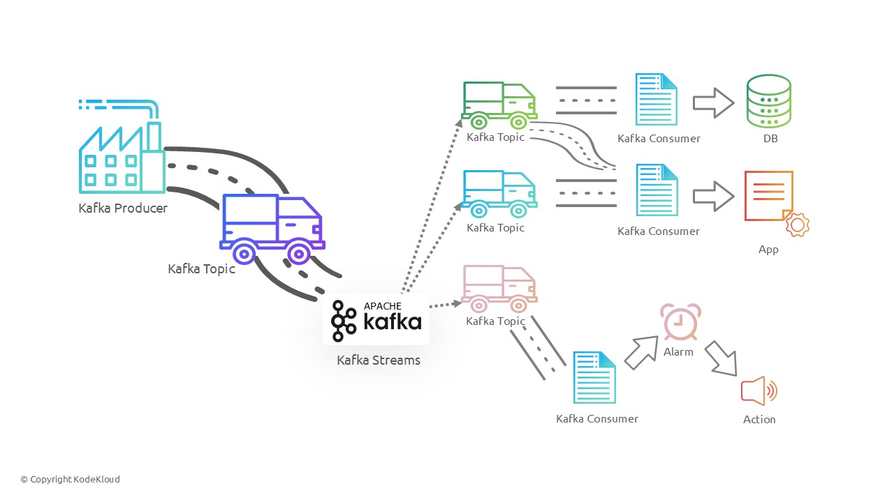

## what is Kafka ?
- Apache Kafka is an open-source distributed event streaming platform developed by the Apache Software Foundation. Originally created by LinkedIn, it was open-sourced in early 2011. Kafka is designed to handle real-time data feeds, enabling organizations to build robust, scalable, and fault-tolerant data pipelines.

- 

## core components of Apache Kafka

Producer: Producers are applications that send records to Kafka topics. They are responsible for choosing which partition within the topic the record should be sent to.
Consumer: Consumers are applications that read records from Kafka topics. Consumers subscribe to topics and process the messages in real time.
Broker: A Kafka broker is a server that runs Kafka. Brokers receive messages from producers, store them on disk, and serve them to consumers. A Kafka cluster consists of multiple brokers to ensure load balancing and fault tolerance.
Topic: A topic is a logical channel to which producers send records and from which consumers read. Topics are partitioned for scalability and parallelism.
Partition: Each topic is divided into partitions, which are ordered, immutable sequences of records. Partitions allow Kafka to scale horizontally and maintain the order of records within each partition.
ZooKeeper: Kafka uses Apache ZooKeeper for distributed coordination, configuration management, and leader election for Kafka brokers and topics.


## Kafka Architecture

Kafka's architecture revolves around topics, partitions, and brokers. Here's a breakdown of the key architectural elements:

Topics and Partitions: Topics are divided into partitions, which are the fundamental unit of parallelism and scalability in Kafka. Each partition is an ordered, immutable sequence of records, and each record within a partition is assigned a unique offset. Partitions enable Kafka to scale by distributing data and load across multiple brokers.
Producers and Consumers: Producers write data to Kafka topics, and consumers read data from topics. Kafka supports a publish-subscribe model where multiple consumers can subscribe to the same topic and process the data independently.
Brokers and Clusters: Kafka brokers are responsible for storing and serving data. A Kafka cluster consists of multiple brokers, which ensures fault tolerance and high availability. Brokers are distributed across different machines to prevent data loss in case of hardware failures.
ZooKeeper Coordination: ZooKeeper manages the configuration and coordination of Kafka brokers. It helps in leader election for partitions and keeps track of broker metadata. However, newer versions of Kafka (starting from version 2.8) are moving towards removing ZooKeeper dependency with the introduction of the KRaft mode

### Kafka's Role as a Distributed Streaming Platform

Apache Kafka serves as a distributed streaming platform with a broad range of applications. Here are some of its key roles:

Real-Time Data Ingestion: Kafka is widely used for ingesting real-time data from various sources such as logs, sensors, and user interactions. It provides a scalable and fault-tolerant way to collect and store large volumes of data.
Stream Processing: Kafka integrates seamlessly with stream processing frameworks like Apache Flink, Apache Spark, and Kafka Streams. This allows organizations to process and analyze data in real time, enabling use cases like fraud detection, recommendation engines, and monitoring.
Data Integration: Kafka acts as a central hub for data integration, enabling the movement of data between different systems and applications. It supports connectors for various data sources and sinks, making it easy to build data pipelines.
Event Sourcing: Kafka is used for event sourcing, where state changes in an application are logged as a sequence of events. This approach provides a reliable and auditable way to track changes over time.
Message Queue: Kafka can function as a distributed message queue, enabling asynchronous communication between different parts of an application. It supports decoupling of producers and consumers, which enhances the scalability and resilience of applications.
Log Aggregation: Kafka is commonly used for log aggregation, where logs from multiple services are collected, centralized, and processed. This helps in monitoring, troubleshooting, and gaining insights from log data.
Metrics Collection and Monitoring: Kafka can be used to collect and aggregate metrics from various systems, enabling real-time monitoring and alerting. This helps in maintaining the health and performance of applications and infrastructure.

### Kafka Ecosystem

- The Kafka ecosystem consists of various tools and frameworks that extend its capabilities:

Kafka Connect: Kafka Connect is a framework for connecting Kafka with external systems such as databases, key-value stores, search indexes, and file systems. It provides connectors that can move data into and out of Kafka.
Kafka Streams: Kafka Streams is a lightweight stream processing library that allows developers to build real-time applications and microservices. It provides a high-level API for processing data streams and supports stateful computations.
Kafka REST Proxy: The Kafka REST Proxy provides a RESTful interface to interact with Kafka. It allows applications to produce and consume messages using HTTP, which is useful for integrating with systems that cannot use the native Kafka clients.
Schema Registry: The Confluent Schema Registry provides a centralized repository for managing schemas used in Kafka topics. It ensures that data is serialized and deserialized consistently, enabling schema evolution and compatibility.
KSQL: KSQL is a SQL-like stream processing engine for Kafka. It allows users to write SQL queries to process and analyze data streams in real time. KSQL simplifies stream processing by providing an intuitive and familiar query language.

### Usecases of Apache Kafka

Real-Time Analytics: Companies use Kafka to analyze data in real time, providing insights and enabling proactive decision-making.
Event-Driven Architectures: Kafka enables event-driven architectures where different services communicate through events, enhancing scalability and decoupling.
Microservices: Kafka facilitates communication between microservices, allowing them to exchange messages asynchronously and reliably.
Log Aggregation and Monitoring: Kafka is widely used for collecting and aggregating logs from various services, enabling centralized monitoring and alerting.
Data Integration: Kafka serves as a backbone for data integration, moving data between different systems and ensuring consistency and reliability

### Why Kafka is used over other Providers 

Apache Kafka is favored over other messaging and streaming platforms for several reasons, attributable to its unique architecture, robust feature set, and performance characteristics. Here’s a detailed look at why Kafka stands out:

1. High Throughput and Low Latency
Performance: Kafka is designed to handle high-throughput, real-time data streams with minimal latency. It achieves this through efficient disk storage mechanisms and high-performance networking capabilities. Kafka’s architecture allows it to process millions of messages per second, making it suitable for applications requiring high throughput.

2. Scalability
Horizontal Scalability: Kafka’s distributed nature allows it to scale horizontally by adding more brokers to a cluster. Each topic in Kafka is partitioned, and these partitions can be spread across multiple brokers. This architecture ensures that Kafka can handle increasing loads without degradation in performance.

Elasticity: Kafka’s partition-based architecture allows for dynamic scaling. As the load increases, more partitions and brokers can be added without downtime, providing elastic scalability.

3. Durability and Fault Tolerance
Replication: Kafka replicates data across multiple brokers, ensuring data durability and availability. This replication mechanism guarantees that even if one or more brokers fail, the data remains accessible.

Log-Based Storage: Kafka’s use of log-based storage ensures that data is persisted on disk in an append-only fashion. This approach minimizes data corruption and allows for efficient data recovery.

4. Flexibility and Versatility
Multiple Use Cases: Kafka is versatile and supports various use cases, including real-time analytics, event sourcing, log aggregation, metrics collection, and stream processing. Its ability to handle a wide range of scenarios makes it a preferred choice for many organizations.

Integration with Ecosystem: Kafka integrates seamlessly with a wide array of tools and frameworks, such as Kafka Connect for data integration, Kafka Streams for stream processing, and external processing frameworks like Apache Flink and Apache Spark. This extensibility makes it a central component of many data architectures.

5. Message Ordering and Guarantee
Message Ordering: Kafka ensures strict ordering of messages within a partition, which is crucial for applications where the order of events is important.

Delivery Semantics: Kafka supports various delivery semantics, including at-most-once, at-least-once, and exactly-once delivery. This flexibility allows developers to choose the appropriate level of guarantee based on their application requirements.

6. High Availability
Leader-Follower Architecture: Kafka’s leader-follower model ensures high availability. Each partition has one leader and multiple followers. If the leader fails, one of the followers automatically takes over, ensuring continuous availability without manual intervention.

7. Cost Efficiency
Efficient Resource Utilization: Kafka’s design allows for efficient use of resources, both in terms of storage and compute. Its log-structured storage mechanism minimizes disk I/O, and its distributed nature ensures load balancing across the cluster.

Open Source: As an open-source project, Kafka eliminates licensing costs associated with proprietary messaging systems, making it a cost-effective solution for many organizations.

8. Active Community and Support
Vibrant Community: Kafka has a large and active open-source community. This community continuously contributes to the platform, ensuring it evolves with new features, performance improvements, and bug fixes.

Commercial Support: Organizations like Confluent offer commercial support and additional features, making Kafka a viable choice for enterprises that require professional support and enhanced capabilities.

9. Stream Processing Capabilities
Kafka Streams: Kafka provides a native stream processing library called Kafka Streams, which allows for building real-time processing applications directly within the Kafka ecosystem. This integration simplifies the development and deployment of stream processing applications.

KSQL: Kafka also offers KSQL, a SQL-like language for stream processing. KSQL enables users to perform stream processing tasks using SQL queries, making it accessible to users who are more familiar with SQL than with traditional programming languages.

### Comparision with other providers

Kafka vs. RabbitMQ
Throughput: Kafka typically offers higher throughput compared to RabbitMQ, making it more suitable for high-volume data streams.
Scalability: Kafka’s partition-based architecture scales more easily and efficiently than RabbitMQ’s queue-based model.
Durability: Kafka’s log-based storage and replication provide better durability and fault tolerance.
Kafka vs. Apache Pulsar
Architecture: Pulsar uses a layered architecture with separate serving and storage layers, which can offer advantages in some scenarios, but Kafka’s integrated architecture is simpler and has proven performance.
Maturity and Ecosystem: Kafka has a more mature ecosystem with a broader range of integrations and tools. Pulsar is newer and still catching up in terms of ecosystem and community support.
Kafka vs. Amazon Kinesis
Vendor Lock-In: Kafka is open-source and can be run on-premises or in any cloud environment, while Kinesis is a proprietary service offered by AWS, leading to potential vendor lock-in.
Feature Set: Kafka’s feature set, including Kafka Streams and Kafka Connect, offers more flexibility and integration options compared to Kinesis.
Conclusion
Apache Kafka is a powerful distributed event streaming platform that plays a crucial role in modern data architectures. Its ability to handle high throughput, provide fault tolerance, and integrate with various processing frameworks makes it an essential tool for real-time data ingestion, processing, and integration. With its robust ecosystem and wide range of use cases, Kafka continues to be a key component in building scalable and resilient data-driven applications.

### Setting up Kafka Environment
- Apache Kafka is a powerful distributed streaming platform that enables you to build real-time streaming data pipelines and applications. Setting up a Kafka environment involves installing Kafka itself along with ZooKeeper, which Kafka uses for cluster management. This guide will walk you through the process of setting up a Kafka environment from scratch, making it as straightforward as possible for beginners

### Pre-requisites
- Before diving into the Kafka setup, ensure you have the following prerequisites covered:

A Linux-based system (the commands here are tailored for a Linux environment)
Basic command-line knowledge
curl installed on your system to download Kafka
tar for extracting the Kafka archive
Java installed, as Kafka requires it to run
Root or sudo privileges for creating service files

**step 1: Downloading Kafka**
- Apache Kafka is available for download on its official website. However, for convenience, we'll use curl to download Kafka directly from the command line. The following commands download Kafka version 3.7.1. Make sure to navigate to the Kafka download page to check if a newer version is available

`curl -L https://downloads.apache.org/kafka/3.7.1/kafka_2.13-3.7.1.tgz -o ~/Downloads/kafka.tgz`

**step 2: Extracting Kafka**
- Once the download is complete, you'll need to extract the Kafka archive to a directory of your choice. The following commands create a new directory for Kafka in your home directory and extract the archive there

`mkdir ~/kafka && cd ~/kafka
tar -xvzf ~/Downloads/kafka.tgz --strip 1 -C ~/kafka`

**step 3: Setting up Zookeeper**
- Kafka uses ZooKeeper to manage cluster metadata and configurations. Although Kafka comes with a ZooKeeper configuration out of the box, we'll need to create a system service for ZooKeeper to ensure it starts automatically with your system

**creating a zookeeper systemd service**

- create a systemd service file for zookeeper using the following command. This will open a text editor in your terminal where you can paste the service configuration.

`sudo nano /etc/systemd/system/zookeeper.service`

paste the following configuration into the editor.

```
[Unit]
Requires=network.target remote-fs.target
After=network.target remote-fs.target

[Service]
Type=simple
User=root
ExecStart=/root/kafka/bin/zookeeper-server-start.sh /root/kafka/config/zookeeper.properties
ExecStop=/root/kafka/bin/zookeeper-server-stop.sh
Restart=on-abnormal

[Install]
WantedBy=multi-user.target
```
save and close the editor.

**step 4: Setting up Kafka Server**
- Simmilar to zookeeper, kafka also requires a system service for automatic management. use the following command to create a kafka service file. `sudo nano /etc/systemd/system/kafka.service`

- paste the below configuration into the editor

```
[Unit]
Requires=zookeeper.service
After=zookeeper.service

[Service]
Type=simple
User=root
ExecStart=/bin/sh -c '/root/kafka/bin/kafka-server-start.sh /root/kafka/config/server.properties > /root/kafka/kafka.log 2>&1'
ExecStop=/root/kafka/bin/kafka-server-stop.sh
Restart=on-abnormal

[Install]
WantedBy=multi-user.target
```

- save and close the editor.

**step 5: starting the services**
- with both service files in place, you can now enable and start Zookeeper and Kafka

```
sudo systemctl enable zookeeper
sudo systemctl start zookeeper
sudo systemctl enable kafka
sudo systemctl start kafka
```

**Verifying the installation**
- To verify that kafka and zookeeper are running correctly, you can use the `systemctl status` command. `sudo systemctl status zookeeper ; sudo systemctl status kafka`

- If everything is setup correctly, you should see that both services are active.


```
sudo apt update && sudo apt install -y openjdk-17-jdk

curl -L https://downloads.apache.org/kafka/3.7.1/kafka_2.13-3.7.1.tgz -o /home/bob/kafka.tgz  #Kafka Download

sudo vi /etc/systemd/system/zookeeper.service
  # Add content to the zookeeper.service 
[Unit]
Requires=network.target remote-fs.target
After=network.target remote-fs.target

[Service]
Type=simple
User=root
ExecStart=/home/bob/kafka/bin/zookeeper-server-start.sh /home/bob/kafka/config/zookeeper.properties
ExecStop=/home/bob/kafka/bin/zookeeper-server-stop.sh
Restart=on-abnormal

[Install]
WantedBy=multi-user.target

# Reload systemd daemon
sudo systemctl daemon-reload

# create kafka systemd service
sudo vi /etc/systemd/system/kafka.service

# Add the following content to it

[Unit]
Requires=zookeeper.service
After=zookeeper.service

[Service]
Type=simple
User=root
ExecStart=/bin/sh -c '/home/bob/kafka/bin/kafka-server-start.sh /home/bob/kafka/config/server.properties > /home/bob/kafka/kafka.log 2>&1'
ExecStop=/home/bob/kafka/bin/kafka-server-stop.sh
Restart=on-abnormal

[Install]
WantedBy=multi-user.target
```
- save and close the file
- Finally, Reload the systemd daemon to apply the changes.
`sudo systemctl daemon-reload`

```
sudo systemctl enable zookeeper #Enable zookeeper
sudo systemctl start zookeeper #start the zookeeper service
sudo systemctl enable kafka #enable kafka to start at boot
sudo systemctl start kafka #start the kafka service
```
- Follow these steps to install Kafdrop and set it up as a systemd service for your Kafka cluster:
Step 1: Download Kafdrop

Use the following curl command to download the Kafdrop JAR file to the /opt directory:

`sudo curl -L https://github.com/obsidiandynamics/kafdrop/releases/download/4.0.2/kafdrop-4.0.2.jar -o /opt/kafdrop-4.0.2.jar`

step 2: Create a systemd service for kafdrop

1. Create a systemd service file for kafdrop. open a file using a text editor. `sudo vi /etc/systemd/system/kafkaui.service`
2. Add the below content to the service file :

```
[Unit]
Description=Web UI for administration of Kafka clusters
Requires=kafka.service
After=kafka.service

[Service]
User=root
WorkingDirectory=/opt/
ExecStart=/usr/bin/java --add-opens=java.base/sun.nio.ch=ALL-UNNAMED -jar kafdrop-4.0.2.jar --kafka.brokerConnect=ubuntu-host:9092
StartLimitInterval=0
RestartSec=10
Restart=always

[Install]
WantedBy=multi-user.target
```
3. Reload the systemd daemon to recognize the new service file. `sudo systemctl daemon-reload`
4. Enable and start the kafdrop service

```
sudo systemctl enable kafkaui.service
sudo systemctl start kafkaui.service
```

## Developing with Kafka: Producers

#### Writing kafka Producers
- Apache kafka is a distributed streaming platform taht enables the publication and subscription of streams of records in a fault-tolerant, durable manner. 
- Kafka producers are responsible for sending data to kafka topics, where it can be processed by consumers.
- Below provides detailed explanation of creating kafka producers in both java and python, focusing on establishing connections, sending messages, and handling errors.

```
Introduction to Kafka Producers
Creating a Kafka Producer in Java
Setting Up a Gradle Project
Establishing Connection
Sending a Message
Error Handling
Creating a Kafka Producer in Python
Setting Up a Python Project
Establishing Connection
Sending a Message
Error Handling
```

1. Introduction to Kafka Producers
- Kafka producers are applications that send records to kafka topics.
- They handle the serialization of data into byte streams and the distribution of records across the various partitions of a topic. 
- Kafka producers are designed to be efficient, scalable and resilient

2. Creating a Kafka Producer in java

setting up gradle project 

```
mkdir kafka-producer
cd kafka-producer
gradle init --type java-application #To initialize gradle project
# Modify build.gradle file to include the kafka dependencies
   plugins {
       id 'application'
   }

   repositories {
       mavenCentral()
   }

   dependencies {
       implementation 'org.apache.kafka:kafka-clients:3.0.0'
   }

   application {
       mainClassName = 'com.example.SimpleProducer'
   }

```

**Establishing connection**
- Create a java class for the producer:

Create `src/main/java/com/example/SimpleProducer.java` and add the below code.

```
   package com.example;

   import org.apache.kafka.clients.producer.KafkaProducer;
   import org.apache.kafka.clients.producer.Producer;
   import org.apache.kafka.clients.producer.ProducerRecord;
   import java.util.Properties;

   public class SimpleProducer {
       public static void main(String[] args) {
           Properties props = new Properties();
           props.put("bootstrap.servers", "localhost:9092");
           props.put("key.serializer", "org.apache.kafka.common.serialization.StringSerializer");
           props.put("value.serializer", "org.apache.kafka.common.serialization.StringSerializer");

           Producer<String, String> producer = new KafkaProducer<>(props);

           String topicName = "example-topic";
           String message = "Hello, Kafka!";

           producer.send(new ProducerRecord<>(topicName, "key1", message));
           producer.close();
       }
   }
```
>> bootstrap.servers: The address of your kafka cluster
>> key.serializer & value.serializer: How to turn the key and value objects the producer will send into bytes.


**Sending a Message :**
- To send a message, create a `ProducerRecord` with the topic name, key, and value, then call the `send` method on the producer instance.

Example code to sent a message :

```
String topicName = "example-topic";
String key = "key1";
String value = "Hello, Kafka!";

// Create a ProducerRecord
ProducerRecord<String, String> record = new ProducerRecord<>(topicName, key, value);

// Send the record
producer.send(record);

```

>> ProducerRecord<String, String> record = new ProducerRecord<>(topicName, key, value);: Creates a record with the specified topic, key, and value.
>> producer.send(record);: Sends the record to the Kafka cluster.


#### Error Handling
- To handle errors, you can use callbacks and try-catch blocks. Modify the `send` method to include a callback

```
producer.send(new ProducerRecord<>(topicName, key, value), (metadata, exception) -> {
    if (exception == null) {
        System.out.println("Message sent successfully to topic " + metadata.topic() + " partition " + metadata.partition() + " offset " + metadata.offset());
    } else {
        System.err.println("Error sending message: " + exception.getMessage());
    }
});
```

- Additionally, ensure to close the producer in a `finally` block to release resources :

```
try {
    producer.send(new ProducerRecord<>(topicName, key, value), (metadata, exception) -> {
        if (exception == null) {
            System.out.println("Message sent successfully to topic " + metadata.topic() + " partition " + metadata.partition() + " offset " + metadata.offset());
        } else {
            System.err.println("Error sending message: " + exception.getMessage());
        }
    });
} catch (Exception e) {
    System.err.println("Error: " + e.getMessage());
} finally {
    producer.close();
}
```

>> `try-catch-finally`: ensures that the producer is closed properly even if an error occurs.
>> `callback`: Handles the result of the send operation, printing success or error messages.

## 3. Creating a kafka producer in python

#### setting up a python project

1. create a New Directory for the project
```
mkdir kafka-producer
cd kafka-producer
```
2. create and activate a virtual Environment

```
python3 -m venv venv
source venv/bin/activate
```

3. Install kafka-python. `pip install kafka-python`