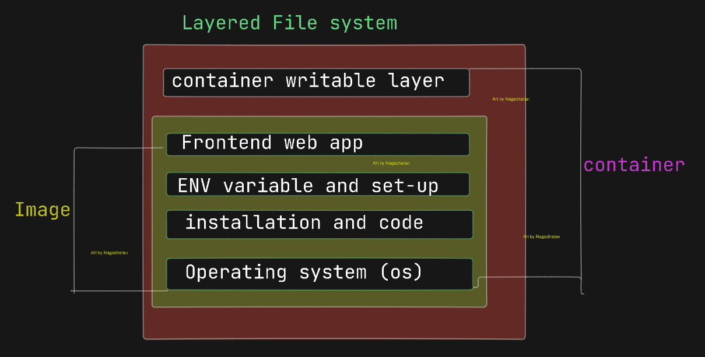
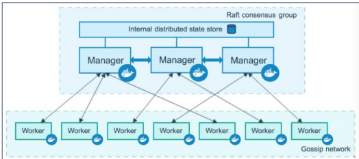
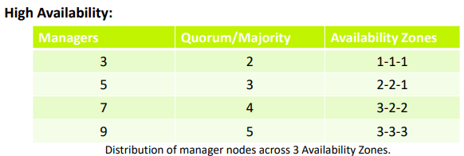
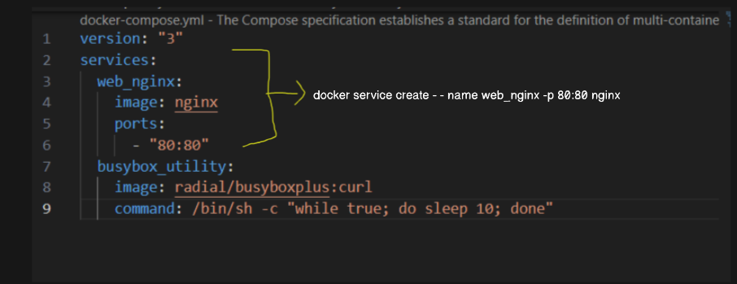
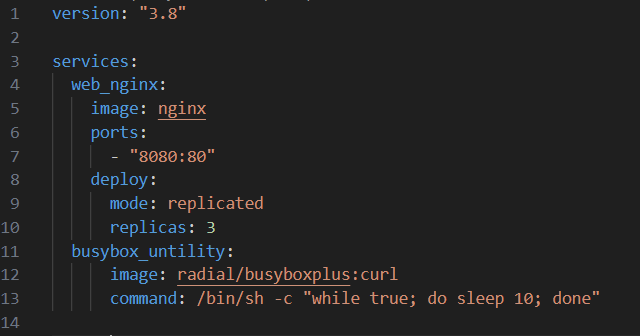
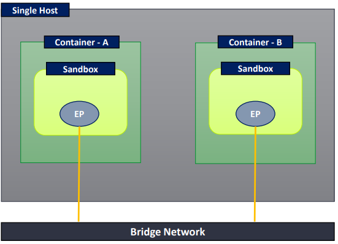
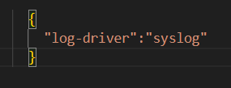

## what is Docker ?
- Docker is an opensource software tool which allows us to create, run, deploy applications using containers
- Docker uses a technology called namespaces to provide the isolated workspace called the container. When you run a
container, Docker creates a set of namespaces for that container
- Docker is written in GO language
- Docker enables you to separate your applications from your infrastructure so you can deliver software quickly.
- With Docker, you can manage your infrastructure in the same ways you manage your applications


- Docker Inc. was founded by Kamel Founadi, Solomon Hykes, and Sebastien Pahl during the Y Combinator Summer 2010
startup incubator group and launched in 2011
- Docker is available in two editions 1. Community Edition and 2. Enterprise Edition

## Docker Architecture


Components of Docker Architecture :

```
> Docker Client

> Docker Daemon

> Docker containers

> Docker Images

> Docker Registry
```


- Docker uses **client-server architecture**.
- **Docker client** talks to the docker daemon using REST API protocol over unix sockets or network interfaces
- Docker daemon does the heavy lifting of building, running and distributuing docker containers
- **Docker daemon (dockerd)** is the docker engine (which represents the server ) listens for docker api requests and manages docker objects like images, containers, networks and volumes.
- **Docker registry** stores the docker images
- **Docker Hub** is a public registry that anyone can use, and Docker is configured to look for images on Docker Hub by
default. You can even run your own private registry.
- When you use the docker pull or docker run commands, the required images are pulled from your configured registry.
- When you use the docker push command, your image is pushed to your configured registry.

### Docker Images

- An image is a read-only template with instructions for creating a Docker container. Often, an image is based on
another image, with some additional customization. 

or

- Docker image is a file which contains dependencies , binaries and required configuration to run software inside a container

- An image is built up of series of layers and 
each layer represents an instruction in the 
image

- When a container is created from an 
image it adds a new writable layer on top 
of the image layers.
This layer is called as "container layer"

For example, you may build an image which is based on the
Ubuntu image, but installs the Apache web server and your application, as well as the configuration details needed to
run application.
- Docker template is written in a language called YAML, which stands for Yet Another Markup Language. 
- The Docker image is built within the YAML file and then hosted as a file in the Docker registry.

- Dockerfile extension is `Dockerfile`

**Note:** 
- we can use `docker` also but as a best practice we use `D` at the begining of dockerfile name

- same applicable for all the instructions in the dockerfile also like using `FROM` instead of `from` etc.

- Ex for keywords in docker file are : FROM, WORKDIR, COPY, RUN, CMD etc.

`$ docker pull <image name>:<tag>`

`$ docker image pull <image name>:<tag>` (recommended way)



`$ docker image history <image name>` --> to list all layers of an image


#### Dockerfile
- Dockerfile is a set of instructions and commands used to build an image

**Build image**
```
docker image build -t <tag> .
docker image build -t <tag> -f <dockerfile name> .
docker image build --no-cache -t <tag> .
```

Keypoints to remember:
- Ephermeral container
- Order of execution
- Keep image size minimum
    > Avoid unnecessary package and files
    > use multi-stage build
    > keep number of layers to minimum

👇 Basic Dockerfile


👇 Dockerfile for python application


- Each prorgram language has it's own commands so, arguments will change but not the Instructions

```
Instruction ARGUMENT
|          |
FROM baseImage
```

##### Frequently used Dockerfile Instructions:

```
FROM -> sets base/parent image
LABEL -> Adds metadata to the image
RUN -> creates new layer
EXPOSE -> Intend port to publish
CMD -> Setting default command for container. It can be overridden
ENTRYPOINT -> Specify executable inside the container, it does not get overridden
. It can be overridden by --entrypoint flag
WORKDIR -> sets current working directory
COPY -> copy file from one location to another, if spaces include quotes
ADD -> The ADD instruction in a Dockerfile allows you to copy files or directories from a source location into your Docker image. This source can be a local directory, a URL, or a TAR file.
ENV -> to set environmental variables. It can be overridden by --env flag. ENV [key]=[value]
USER -> set user

ex: USER dockeruser

ARG -> Declared before FROM instruction

HEALTHCHECK -> Checks the health of a container by running a command inside the container.
 > can be only one health check instruction in a docker file

 options for CMD
 ✅ --interval=DURATIOn (default:30s)
 ✅ --timeout=DURATIOn (default:30s)
 ✅ --start-period=DURATION (default:30s)
 ✅ --retries=N(default:3)

 HEALTHCHECK --interval=5s CMD curl localhost:<port>
```
COPY vs ADD
- If you want to extract a TAR file inside a Docker Container or copy files from a URL or local directory, you can specify ADD Instructions inside your Dockerfile. This is different from COPY instruction because COPY instruction only allows you to copy files and directories from the local machine.

**pull image**
`$ docker image pull nginx`

`$ docker image ls`

**search an image**
`$ docker search nginx`

**limit the number of result**
`$ docker search --limit 10 nginx`

**filter search result**
`$ docker search --filter stars=200 nginx`

`$ docker search -f stars=100 -f ls-official=true nginx`

**list images**
`E docker images`
`$ docker image ls`
`$ docker image ls -a`

**tag an image**
`$ docker image tag <source image>:<tag> <reference to source image>:<tag>`

**delete an image**
`$ docker image run nginx`
`$ docker rmi ngnix`
**remove dangling image**
`$ docker image prune`
**remove all unused and dangling image**
`$ docker image prune -a`
inspect an image
`$ docker image inspect nginx`

`$ docker image inspect nginx --format"{{ContainerConfig.Hostname}}"`

#### Flattening an image

- flattening an image to a single layer to save some space and get an extra performance

execution steps
```
docker export
docker import
docker image history
```

**Multi-stage builds**
- Multi-stage builds will have more than one FROM instruction in the dockerfile
- Each FROm instruction creates a new build


**save an image**
- save one or more image to a tar archive
`$ docker image save <image name> > <archive name>.tar`

**load an image**
- load an image from a tar archieve or STDIN

`$ docker image load < <archieve name> `

### Docker Containers

- A container is a runnable instance of an image. You can create, start, stop, move, or delete a container using the
Docker API or CLI.
- You can connect a container to one or more networks, attach storage to it, or even create a new image based on its
current state.
- By default, a container is relatively well isolated from other containers and its host machine. You can control how
isolated a container’s network, storage, or other underlying subsystems are from other containers or from the host
machine.
- Docker Container is a running environment for Image. Images like Redis, Ubuntu, Nginx, Alphine and etc

- When you create containers 
from an image, the container and 
image become dependent on each 
other and you can't delete the image 
until all the containers attached to 
that image have been deleted.
- When the container is deleted, the 
container layer is also deleted. 
However, the underlying image 
remains unchanged.

| Docker | virtual machine |
| --- | --- |
|os level process isolation|Hardware level process isolation|
|Docker makes use of the executable engine| Virtual machine makes use of the hypervisior|
| Lightweight  | High weight |
|Each container can share OS| Each VM has a separate OS|
|Containers are lightweight (KBS/MBS)| VMs are heigh weight (GBS)|
|uses less resources (cpu, memory)|Uses more resources (cpu, memory)|
|Boots in few seconds| Boots in few minutes|
|prebuild containers are easy to find|prebuild Vms are difficult to find|
|creation of containers takes less time|creation of vms is time consuming|

## Docker Installation

To install Docker, please follow instructions given on below links


[For RHEL
](https://docs.docker.com/engine/install/rhel/)

[For CentOS](
https://docs.docker.com/engine/install/centos/)

[For Ubuntu](
https://docs.docker.com/engine/install/ubuntu/)

[ For Mac](
https://docs.docker.com/desktop/install/mac-install/)

[ For Windows](
https://docs.docker.com/desktop/install/windows-install)


- we can verify the installation by using `$ docker --version`

#### Docker - Hello world

- In our first example, we are going to run a container with hello world image.
- To perform this practical, first check docker is running or not and if not then first docker daemon.
- To use this hello world image, to create and run this container with that image use below command
docker run hello-world
- So how above command works in background???
- We are running docker run command which is responsible for launching a container.
- hello-world is the name of the image created by someone on Dockerhub.
- So when we run above command then first it will search that image locally and if image is not available locally then it will 
search in Dockerhub.
- Once hello-world image has been downloaded, docker creates a container using that image and executes it.
- Check below flow for docker hello-world example


## Basic Commands

```
$ docker container run [OPTION1 OPTION2 … OPTIONn] [Image]:[TAG] [COMMAND] [ARGUMENT] --> to instantiate a container

- IMAGE: Docker Image.
- TAG: Run specific version of an image.
- COMMAND: Command to run inside the container.
- ARGUMENT: Arguments for the COMMAND.
```

**Run container**
- `$ docker run hello-world`
- `$ docker container run hello-world` (Recommended way)
- `$ docker run nginx`
- `$ docker container run nginx` (Recommended way)

**Run a container with COMMAND and ARGUMENT:**
`$ docker run busybox echo Hello learners`
```
echo: Command run inside the busybox container.
 Hello Learners!: Argument for the Command.
```

**List all containers (Running and stopped):**
`$ docker ps -a`
- a = all

**Remove a stopped container:**
`$ docker rm <container id>`

**docker help**
`$ docker --help | more`
```
> Management commands
> Commands
```
**Management commands**

**containers**: Manage containers
```
$ docker container --help
- run : Run a command in a new container
- ls : list containers
- rm : Remove one or more containers

```
**image**: Manage images
**network**: Manage networks
**node**: Manage swarm nodes

**Run container with options**
```
$ docker container run nginx
$ docker container run -d --name mynginx nginx:1.18.7

-d or --detach: detached/background mode
--name: provide desired meaningful name

```
**list running containers**
`$ docker container ls`
**list all containers (running and stopped)**
`$ docker container ls -a`

**remove a container**
`$ docker container rm <container id>`

**publish ports**
```
There are 2 types :
1. --publish or -p
2. --publish-all or -P

--publish or -p:
> publish a container's port(s) to the host
   >> docker container run -d --name [container name] -p [Host port]:[container port] [image]

   ex: docker container run -d --name mynginx -p 8080:80 nginx

--publish or -P :
> publish all exposed ports to random ports
   >> docker container run -d --name [container name] -P [image]

   ex: docker container run -d --name mynginx2 -P nginx
```

**display detailed information of a container**

`$ docker container inspect <container id/container name>`
ex: `docker container inspect mynginx`

**list port mapping**
`$ docker container port <container id/container name>`

ex: `$ docker container port mynginx`

**--interactive or -i or --tty or -t**
when you detach from the container it is going to stop the container.

--interactive or -i : keep STDIN open even if not attached
--tty or -t : Allocate pseudo-TTY

- `$ docker container run --name [container name] -it [image]`

ex: `$ docker container run --name myubuntu -it ubuntu`

**attach**
- attach local standard input, output, and error streams to a running container
- when you detach from the container, it's going to stop the container
`$ docker container attach [container name/container id]`
`$ docker container attach myubuntu`

**exec**
- Run a command in a running container
- exec  will not stop the container when you detach from the running container
`$ docker container exec [options][container id/container name][command][arguments]`
ex: `$ docker container exec -it myubuntu /bin/bash`

**container restart policy**
- Automatically start the containers when they exit, or when docker restarts
    `$ docker container run [options] --restart [restart policy][image]`

Types of restart policies:
- no
- on-failure
- always
- unless-stopped

```
no:
> default restart policy
> do not automatically restart the container

Ex: docker container run --restart no nginx
 
 docker container run nginx (same as above)

 on-failure:
 > Restart the container if it exits due to an error (i.e; non-zero exit code)
 ex: docker container run --restart on-failure [image]

 always:
 > always restart the container if it stops. if it is manually stopped, it is restarted only when docker daemon restarts or the container itself is manually restarted

 ex: docker container run -d --name mynginx --restart always -p 8080:80 nginx

 unless-stopped:
 > simmilar to always, except that when the container is stopped (manually or otherwise), it is not restarted even after docker daemon restarts

 ex: docker container run -d --name mynginx --restart unless-stopped -p 8081:80 nginx
```


**container basic commands:**

**list running containers**
`$ docker container ls `(recommended way)

`$ docker ps`

**list all containers (running and stopped)**
`$ docker container ls -a`(recommended way)

`$ docker ps -a`

**stop a container**
`$ docker container stop <container id/container name>`

**start a container**
`$ docker container start <container id/container name>`

**pause a container**
`$ docker container pause <container id/container name>`

**unpause a container**
`$ docker container unpause <container id/container name>`
**fetch the logs of a container**
`$ docker container logs <container name/container id>`

**To see container resource usage statistics**
`$ docker container stats <container id/container name>`

**To see running processes of a container**
`$ docker container top <container id/container name`

### Image basic commands

**pull an image**
    `$ docker image pull <image>`
**list images**
`$ docker image ls`
**to see detailed information of an image**
`$ docker image inspect <image>`

### cleanup: Remove Images and Containers

**Remove a stopped container**
    `$ docker container rm <container id/container name>`
**Remove all stopeed containers**
    `$ docker container prune`

**Remove a running container**
`$ docker container rm -f <container name/container id>`
**Remove all stopped and running containers**
`$ docker container rm -f ` `docker ps -a -q`
`$ docker container rm -f` `docker container ls -a -q`
**Remove an image**
`$ docker image rm <image>`
**Automatically remove a container when it exists**
`$ docker container run --rm <image>`

#### Uninstall and upgrade docker

uninstall docker engine
```
- sudo systemctl stop docker
- sudo apt-get remove -y docker-ce docker-ce-cli
- sudo apt-get update
```

install docker engine (lower version)

`$ sudo apt-get install -y docker-ce=5:18.09.4~3-0~ubuntu-bionic docker-ce-cli=5:18.09.4~3-0~ubuntu-bionic`

check docker engine version
`$ docker version`

upgrade docker engine
`$ udo apt-get install -y docker-ce=5:18.09.5~3-0~ubuntu-bionic docker-ce-cli=5:18.09.5~3-0~ubuntu-bionic
`

## Persistent and non-persistent storage
**Docker storage**
- Store and manage container data
Two types of storage:
1. Non-Persistent
2. Persistent

**1. Non-Persistent storage**
- Data stored within the container
- Get deleted when container deleted
- All container has it by default
- storage Drivers:
    > RHEL/Latest Ubuntu & Centos uses overlay2
    > Ubuntu 14 and older uses aufs
    > CentOs7 and older uses devicemapper
    > windows uses its own
- Storage location :
    > linux: /var/lib/docker/[storage driver]
    > windows: c:\ProgaramData\Docker\windowsfilter\

**2. Persistent storage**
 - Data does not reside within the container
 - Does not get deleted when container deleted
 - Two types of Persistent storage:
 1. Volumes and 2. Bind Mounts

## Docker storage - volumes
 1. Volumes :
 > Mounted to a directory in a container
 > Storage location: 
        - Linux : /var/lib/docker/volumes/
        - windows: c:\ProgramData\Docker\volues
> supports 3 rd party drivers:
        - Block storage Ex: Amazon AWS EBS
        - File Storage EX: Amazon EFS
        - Object storage EX: Amazon S3

**Volume CLI**
- Create a volume ->`$ docker volume create [volume name]`
- List volumes -> `$ docker volume ls`
- inspect a volume -> `$ docker volume inspect[volume name]`
- Remove a volume -> `$ docker volume rm [volume name]`
- Delete all unused volumes -> `$ docker volume prune`

There are two ways to mount volume into a docker
1. --mount
```
syntax:

docker container run -d \
        --name mynginx1 \
        --mount type=volume,\
        --source=nginxvolume,\  <---- Docker volume create nginxvolume
        target=/usr/share/nginx/html/\  <-- directory inside mynginx container
        nginx

```
2. --volume or -v

```
syntax:

docker container run -d\
        --name mynginx2 \
        -v nginxvolume:/usr/shared/nginx/html/\
        nginx
```

Note: volume should Not start with slash(/): correct way ` -v nginxvolume:/usr/shared/nginx/html/` incorrect way `-v /nginxvolume:/usr/shared/nginx/html/`


## Docker storage - Bind mounts, volume instruction
2. Bind Mounts:
    - File or directory on the host system is mounted into a container's file or directory

Two ways to create Bind Mounts:
1. --mount
syntax:
```
docker container run -d\
        --name nginxbind1\
        --mount type=bind,\
        source="$(pwd)"/bindexample,\ <-- mkdir bindexample
        target=/app\ <-- directory inside nginxbind1 container
        nginx
```
2. --volume or -v
syntax:
```
docker container run -d \
        --name nginxbind2 \
        -v /user/username/bindexample2:/app \
        nginx
```
Bind mount is a file or directory on the host system. Therefore, BindMount name should start with (/)slash

correct way `-v /username/bindexample2:/app`
incorrect way `-v user/username/bindexample2:/app`

- volume instruction automatically creates a volume and mounts that volume to specified directory

```
# sample Dockerfile
FROM nginx
LABEL description="using Volume Instruction"
VOLUME ["/usr/share/nginx/html/"]

```
## storage drivers
- Provides temporary internal storage for containers
- Manages and controls how images and containers are stored on your docker host

**check default storage driver:**
- docker info
- docker info | grep storage

Method-1: Edit unit file (docker.service)

- Add --storage-driver flag
```
sudo vi /lib/systemd/system/docker.service
ExecStart=/usr/bin/dockerd --storage-driver devicemapper -H fd:// --containerd=/run/containerd/containerd.sock
```

- Restart the docker
```
sudo systemctl daemon-reload
sudo systemctl restart docker
```

Method-2: Configuration file(daemon.json)
- Configure daemon file
    `$ sudo vi /etc/docker/daemon.json`
    ```
    {
        "storage-driver":"devicemaper"
    }
    ```
- Restart Docker
    ```
    sudo systemctl restart docker
    sudo systemctl status docker
    ```
## Docker swarm

- Run containers on multiple servers as a cluster
- Build distributed cluster of docker machine. cluster consits of onee or more nodes
- supports orchestration, high-availability, scaling, load balancing etc
- swarm uses mutual transport layer security (TLS) for communication and authentication of nodes

Two types of nodes in swarm:
1. Manager 
2. Worker


**Manager**
- Assign work to worker nodes
- Responsible for controlling the cluster and orchestration

**workers**
- Responsible for running container workloads and accepting tasks from the manager node 



**Docker swarm set-up:**
1. Configure swarm manager
2. Add worker node to swarm manager

**Configure swarm manager**

```
docker info | grep swarm

docker swarm init --advertise-addr <swarm manager private Ip>

docker info | grep swarm

docker node ls
```

**Add workers node to swarm manager**
- install Docker CE
-`$ docker swarm join-token worker `(on swarm manager)
- `$ copy and run the swarm join-token output` (on worker node)
- `$ docker node ls` (on swarm manager)

**swarm and Node commands**
- List all nodes (on Manager) `$ docker node ls`
- To inspect a node `$ docker node inspect [node id]`
- Promote a node to manager `$ docker node promote[node id]`
- demote a node to worker `$ docker node demote [node id]`
- Remove a node from swarm
Step1: on manager `$ docker node rm -f [node name]`
step2: on worker `$ docker swarm leave`

- Generate join-token for worker (on manager)
`$ docker swarm join-token worker`
- Generate join-token for manager (on manager)
`$ docker swarm join-token manager`

**Docker Swarm AutoLock**

**Docker swarm** - encrypt RAFT logs and TLS communication between nodes
**Docker swarm autolock** - provides an un-lock key to un-lock swarm whenever docker restart
**commands**
- Turn on Autolock
```
docker swarm init --autolock=true
docker swarm update --autolock=true
```
- Turn off Autolock `$ docker swarm update --autolock=false`
- unlock swarm manager `$ docker swarm unlock`
- Retrieve unlock key `$ docker swarm unlock-key`
- Rotate unlock key `$ docker swarm unlock-key --rotate`

## Docker services
Docker services:
- Allows us to run applications in the swarm cluster
- one or more containers can be run across the nodes in swarm cluster

Difference :

|Docker container run|Docker service create|
|---|---|
|Runs a single container on a single host| Runs container(s) on 1 to n nodes|
|Not highly available|Highly available|
|Not easily scalable|Easily scalable (up or down)|
|can't use --replicas flag|--replicas used to scale|

#### Docker service CLI :
- Create a service `$ docker service create <image>`
- list services `$ docker service ls`
- list the task(replica) of a service `$ docker service ps <service name>`
- delete a service `$ docker service rm <service name>`

**Scaling a service**
- scale up or scale down a service that's running across swarm clsuter
- Replica flag used to create replica of containers
`$ docker service create --name mynginx --replicas 3 -p 80:80 nginx`

Two ways to scale:
1. Docker service update
    - docker service update --replicas 5 mynginx
    - docker service update --replicas 5 --deatach=true mynginx
        - --detach=true: Not to see progress of service

2. docker service scale
 - scale multiple services at a time
    `$ docker service scale mynginx=2 mybusybox=3`

**Resource Limitation**
- Defining containers CPU and memory requirements
`$ docker service update --limit-cpu=5 --limit-memory=124m --reserve-memory=64m mynginx`

limit `The maximum value of resource that can be used by container`

reservation `the amount of resources required to run the container`

**Template with 'docker service create'**
- Template is used to give dynamic values
```
flags can be used
--mount
--hostname
--env
```
`$ docker service create --name mynginx2 --hostname="{{.Node.Id}}-{{.Service.Name}}" nginx`

####  Replicated and Global mode
###### Replicated Mode:
- default mode
- can scale the service using --replicas
    `$ docker service create --name mynginx --replicas 2 -p 80:80 nginx`
**Global Mode**
- can't scale the service
- --replicas flag can't be used
`$ docker service create myglobalnginx -p 8080:80 --mode global nginx`

#### Docker Swarm Quorum
- 🗳️ Swarm Quorum in Docker In Docker Swarm, a quorum refers to the minimum number of manager nodes that must be available and reachable for the swarm to function properly. This ensures that critical operations, such as adding or removing nodes, can be carried out reliably. 

🧮 Quorum Requirements The specific quorum requirements depend on the number of manager nodes in the swarm. For example, if there are three manager nodes, at least two must be available to maintain a quorum. If a quorum is lost, the swarm may become unstable or even unusable. 

🕵️‍♂️ Maintaining Quorum It is crucial to maintain a sufficient number of healthy manager nodes in a Docker Swarm to ensure quorum availability. This can be achieved by deploying multiple manager nodes across different physical or virtual machines and using redundancy mechanisms like high availability clusters.

- More manager nodes affect the performance of swarm
- Immediately replace failed manager node
- Distribute manager nodes across availability zone(AZ) for High availability (HA)
- Take swarm backup




**Constraint and Label:**

- used to control the placement of containers

Ex1:
- Run tasks only on worker nodes
`$ docker service create --name mynginx_worker --constraint node.role==worker --replicas 3 nginx`

EX2:
- Runnning tasks on particular node
1. Label - `$ docker node update --label-add mynode=node1 <node name>`
2. constraint - `$ docker service create --name mynginx_dc1 --constraint node.labels.mynode==node1 --replicas 3 nginx`

Ex3:
- spread the tasks evenly all nodes having label as mynode
`$ docker service create --name mynginx_spread --placement-pref spread=node.label.mynode --constraint node.role==worker --replicas 4 nginx`

## Docker Compose
- Docker compose can run multi-container application using different images
**install Docker compose**

[installation guide](https://docs.docker.com/compose/install/#installation-scenarios)




**Docker compose commands**
- create a compose `$ docker-compose up -d`
- list containers created by compose `$ docker-compose ps / docker compose ls`
- stop a compose `$ docker-compose start`
- restart a compose `$ docker-compose restart`
- delete a compose `$ docker-compose down`


## Docker stack
- can run services across stack
**Docker stack commands**
- Deploy a stack `$ docker stack deploy -c [compose file name.yml] [stack name]`
- list stacks `$ docker stack ls`
- to see services associated with stack `$ docker stack services <stack name>`
- To see on what nodes tasks are running `$ docker stack ps <stack name>`
- To see logs of a service `$ docker service logs <stack name>`
- To remove a stack `$ docker stack rm <stack name>`
Ex1:  creating replicas



Ex2: using constraints and labels in docker compose file


## Docker Networking
- The docker networking architecture is built on a set of interfaces called Container network model (CNM)
- libnetwork is the networking component which implements the CNM

**Docker Network Drivers**
1. Bridge
2. Overlay
3. Host
4. None
5. MACVLAN
6. 3rd party network drivers

Building Blocks of CNM :


1. sandbox : sandbox isolates the networking components of a single container such as network interfaces, ports, route tables and DNS

2. Endpoints: Endpoints are virtual network interfaces and responsiblity of endpoints is to connect the sandbox to a network.

3. Networks: Network is a collection of endpoints

**Docker networking commands**
- List networks `$ docker network ls`
- create network `$ docker network create <network name>`
- inspect a network `$ docker network inspect <network name>`
- connect a container to a network `$ docker network connect <network name> <container name>`
- disconnect a container from a network `$ docker network disconnect <network name> <container name>`
- create a subnet and gateway `$ docker network create --subnet 10.1.0.0/24 --gateway 10.1.0.1 <network name>`
- Assign a specific Ip to a container `$ docker container run -d --name <container name> --ip <ip address> --network <network name> nginx`
- Remove a network `$ docker network rm <network name>`
- Remove unused networks `$ docker network prune`


**Docker bridge network**
- Docker bridge network is the default network driver for containers running on a single host (not on swarm)
- create a bridge network  `$ docker network create --driver bridge <network name>` or `$ docker network create <network name>`




**overlay network**
- overlay network allows containers running on the same or different nodes (multiple host) to communicate with each other.
- ingress is the default overlay network
- use flag --driver=overlay to create custom overlay network


- To create overlay network
```
docker network create --driver overlay <network name>
docker network create --driver overlay --attachable <network name>
```
- To create services with custom network
`$ docker service create -d --name mynginx --network <network name> --replicas 3 -p 80:80 nginx`

**Host Network**
- No sandbox, No network component isolation
- use host's network infrastructure
- can not reuse the port
- create a host network `$ docker container run -d --name mynginx --network host nginx`

**None network**
- No networking
- Container is isolated from other container and also from host
- create a none network   `$ docker container run -d --name mynginxnone --network none -p 8080:80 nginx`


#### Docker embedded DNS
- name of container or services are mapped back to their actual IP address
- containers can communicate to each other using container name or service name or network alias

commands:
```
docker network create mynetwork
docker container run -d --name mynginx --network mynetwork --network-alias mynetworkalias nginx
docker container run -d --name mybusybox --network mynetwork radial/busyboxplus:curl sleep 1000

docker exec -it mybusybox /bin/sh
        - curl mynginx:80
        - curl mynetworkalias:80
```

## Port publishing modes
Types of port publishing modes:
1. Ingress
2. Host

Ingress:
- the default mode
- Publishes the port on all hosts i.e; all nodes of a swarm cluster. Routing-mesh
- create a service using ingress publishing port: `$ docker service create --name mynginx -p 8080:80 nginx`

Host:
- Publishes the port on host where containers are running
- runs only one task of a service on the same node
- create a service using host publising port `$ docker service create --name mynginxhot -p mode=host, published=8081,target=80 nginx`

## docker security
- Docker uses both Operating system and docker native security features
inux Security Features:
- Namespaces
  -  Process ID (pid)
  - Network (net)
  - Filesystem/mount (mnt)
  - InterProcess Communication (ipc)
  - User (user)
  - Unix Timesharing System (uts)
- Cgroups
   - CPU
   - RAM
-  Seccomp

some of the Docker security features:
- Docker content trust (DCT)
- Docker security scanner
- Docker MTLS

Secure Computing Mode (Seccomp):
- Using Secure Computing Mode (Seccomp) during container creation:
 `$ docker container run --security-opt seccomp=[Profile] Ubuntu`
o Example:
`docker container run -it --name myubuntusec --security-opt seccomp=./default.json `

Capabilities:

- Drop a capability:
`$ docker container run --cap-drop=[Capability] [Image]`
o Example:
- `$ docker container run -it --name mybuntucapdrop --cap-drop=MKNOD ubuntu`
- Add a capability:
`$ docker container run --cap-add=[Capability] [Image]`

Docker Bench for Security:

- `$ docker run -it --net host --pid host --userns host --cap-add audit_control \
-e DOCKER_CONTENT_TRUST=$DOCKER_CONTENT_TRUST \
-v /etc:/etc:ro \
-v /usr/bin/containerd:/usr/bin/containerd:ro \
-v /usr/bin/runc:/usr/bin/runc:ro \
-v /usr/lib/systemd:/usr/lib/systemd:ro \
-v /var/lib:/var/lib:ro \
-v /var/run/docker.sock:/var/run/docker.sock:ro \
--label docker_bench_security \
docker/docker-bench-security`

## docker content trust (DCT)
- DCT is to verify integrity and publisher of an image
- To pull and run signed images

Steps to set-up DCT:
1. Log into the dockerhub `$ docker login`
2. Generate key (.pub) `$ docker trust key generate <dockerhub username>`
3. Add signer to an image repository:
    `$ docker trust signer add --key <.pub> <docker hub username> <repository>`
4. enable docker content trust (DCT)
`$ export DOCKER_CONTENT_TRUST=1`
5. Sign and push image to registry
    `$ docker trust sign <image>:<tag>`

Disable docker content trust (DCT): `export DOCKER_CONTENT_TRUST=0`

logout of docker hub: `$ docker logout`

Mutually Authenticated Transport Layer Security (MTLS):

- Docker Swarm uses mutual Transport Layer Security (TLS) for communication and authentication 
between nodes. 

To Create an encrypted overlay network:
`$ docker network create --opt encrypted --driver overlay [Network Name]`

Uninstall docker engine :

```
sudo systemctl stop docker
sudo apt-get remove -y docker-ce docker-ce-cli
sudo apt-get update
```
## logging drivers
- By default docker uses json-file logging driver
- supported logging drivers :


|Driver|Description|
|---|---|
|none|No logs are available for the container and docker logs does not return any output.|
|local|Logs are stored in a custom format designed for minimal overhead.|
|json-file|The logs are formatted as JSON. The default logging driver for Docker.|
|syslog | Writes logging messages to the syslog facility. The syslog daemon must be running on the host machine.|
|Journald|Writes log messages to journald. The journald daemon must be running on the host machine. 
|gelf|Writes log messages to a Graylog Extended Log Format (GELF) endpoint such as Graylog or Logstash.|
|fluentd|Writes log messages to fluentd (forward input). The fluentd daemon must be running on the host machine|
|awslogs|Writes log messages to Amazon CloudWatch Logs.|
|splunk|Writes log messages to splunk using the HTTP Event Collector.|
|etwlogs|Writes log messages as Event Tracing for Windows (ETW) events. Only available on Windows platforms.|
|gcplogs|Writes log messages to Google Cloud Platform (GCP) Logging. |
|logentries|Writes log messages to Rapid7 Logentries.|

Check default logging driver: `$ docker info` `$ docker info | grep storage`

method-1: Edit Unit file (docker.service)
- add --storage-driver flag
`$ sudo vi /usr/lib/systemd/system/docker.service`
`$ ExecStart=/usr/bin/dockerd --storage-driver devicemapper`
- Restart the docker
`$ sudo systemctl daemon-reload`
`$ sudo systemctl restart docker`

method-2: Configuration file (daemon.json)
- configure daemon file
`$ sudo vi /etc/docker/daemon.json`

- Restart docker
    `$ sudo systemctl restart docker`
    `$ sudo systemctl status docker`
