syllabus :

1. jenkins core concepts
2. what is jenkins 
3. why do we need jenkins
 jenkins jobs
 hello world pipeline
 integrating git
 unittesting with pytest

 environmental variables

 jenkins credentials
 Nested and parallel stages
 parameters & user inputs 
 setting up your first jenkins job
 setting jenkins pipeline
 Manage jenkins plugins
 single server deployment
 deploying app

 ## lambda overview
 deploying lambda function
 configuring jenkins pipeline
 serverless application deployment

 ## Docker overview
 Building custom Docker image
 integrating jenkins with docker
 writing dockerfiles for containerization
securly managing dockerhub credentials in jenkins

## kubernetes overview
EKS
kubernetes pod
replica and deployment
setting up EKS cluster
Deploying application through jenkins pipeline


Github RePo : `https://github.com/kodekloudhub/course-jenkins-project`

## Continuous Integration, CD


what is jenkins ? It's a popular CI/CD Tool.

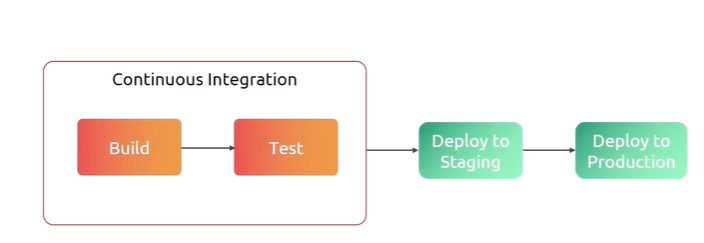

why jenkins ?


jenkins-challenges

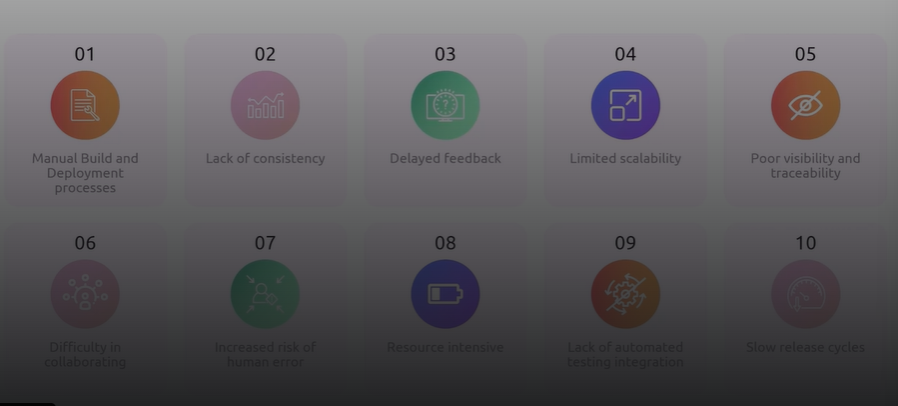

jenkins jobs
- setup of instructions that we want us to do is called job

Jenkins jobs types:

1. Freestyle project
2. Pipeline
3. Multi-container project
4. Folder
5. Multibranch pipeline

```jenkinsfile
pipeline {
    agent any

    stages {
        stage('Hello') {
            steps {
                echo 'Hello world'
            }
        }
    }
}

```

Build trigger types:
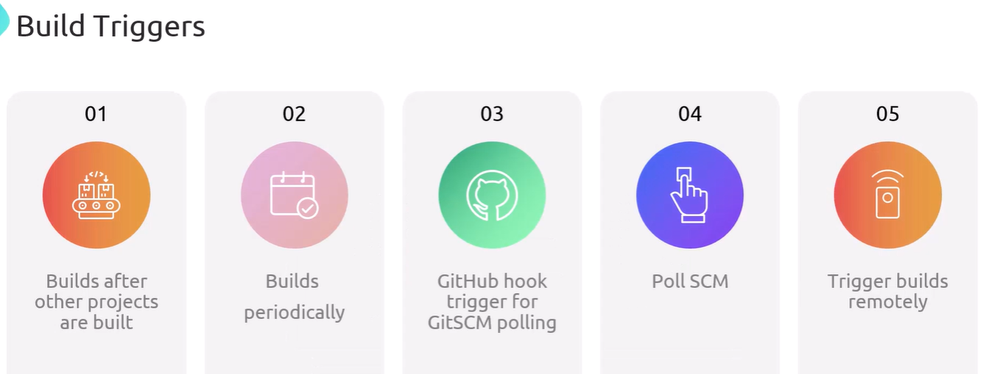

Environmental variables [for any sensitive information]

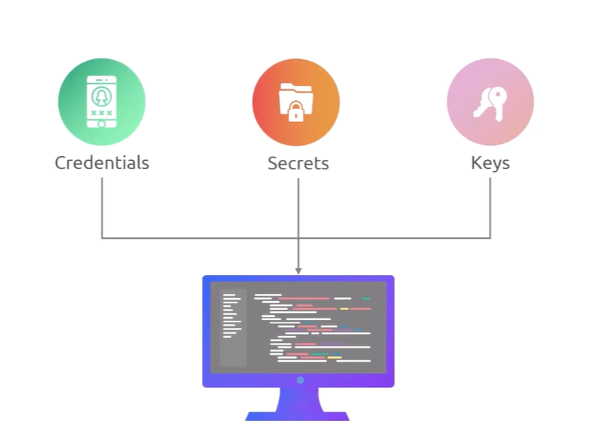

There are two types of environmental variables. 1. System enviornmental variables (PATH) 2. jenkins Environment variables (JOB_NAME)

- we can specify these environmental variables as global, within a job, within a pipeline stage

use cases of environmental variables:
1. Managing credentials
2. Configuring the builds
3. customizing behavior

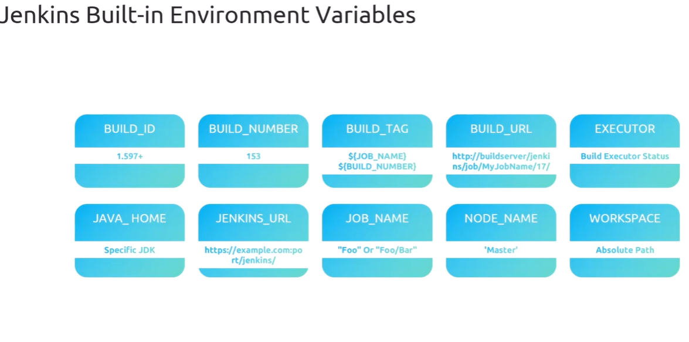


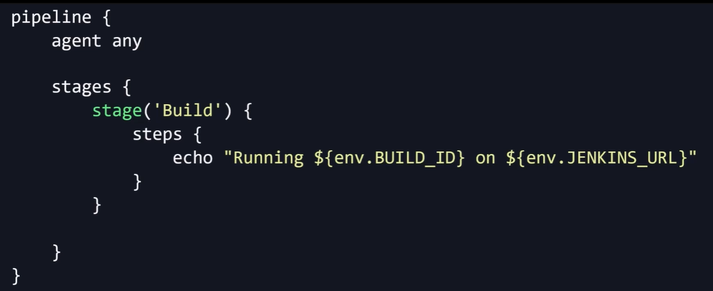


Best practices

1. Keep them secure
2. Keep them consistent
3. Maintain documentation

credentials:

credentials
API Tokens
SSH Keys
Certifications

Benefits : securiity, compilance, efficiency

best practices :

principles of least privilege
Regular audit and rotation
secure storage and access


## lambda function
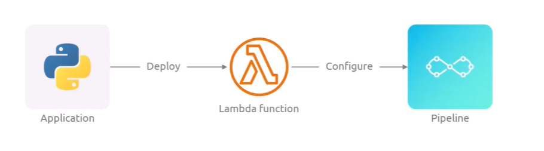

- AWS lambda is a compute service that lets you run the code without having to provision or manage servers

- AWS manages server maintainance, scaling, capacity provisioning and logging

Benefits of lambda :
> NO servers to manage
> Runs on demand
> Automated scaling
> Simple pricing
> wide service integration
> multi-language support
> custom runtime as well
> can be deployed as container image

- Lambda function supports event-driven workflow
- It supports microservices architecture (each function of lambda can have different service)
- lambda API workflow

Lambda pricing : no.of requests your functions receive and amount of compute time they consume
- Increasing memory also increases the CPU power too

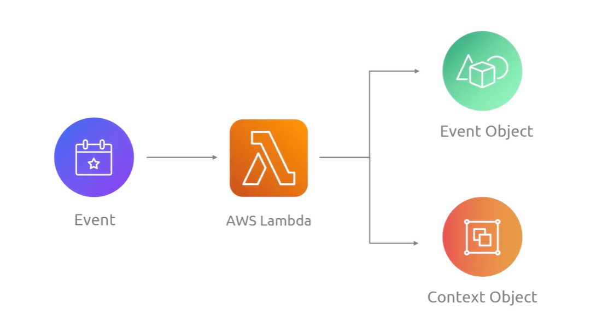

#### AWS serverless application model
- 

Builidng AWS Lambda pipeline

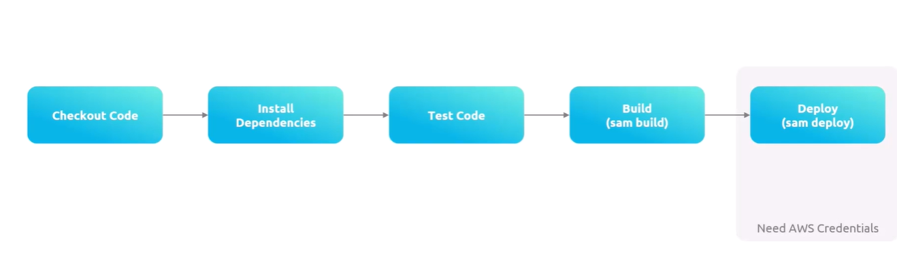


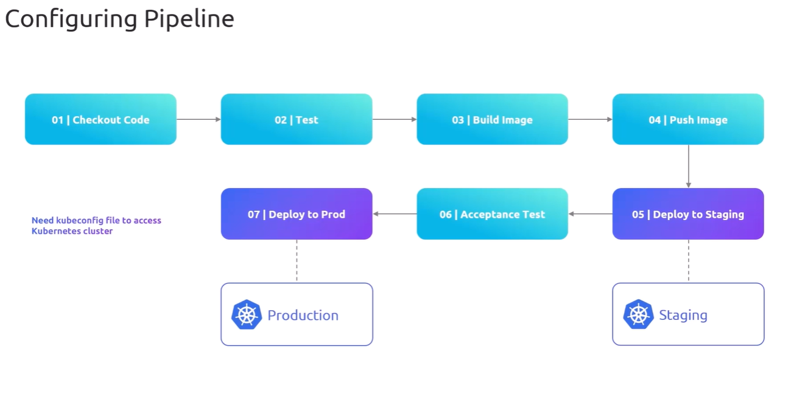


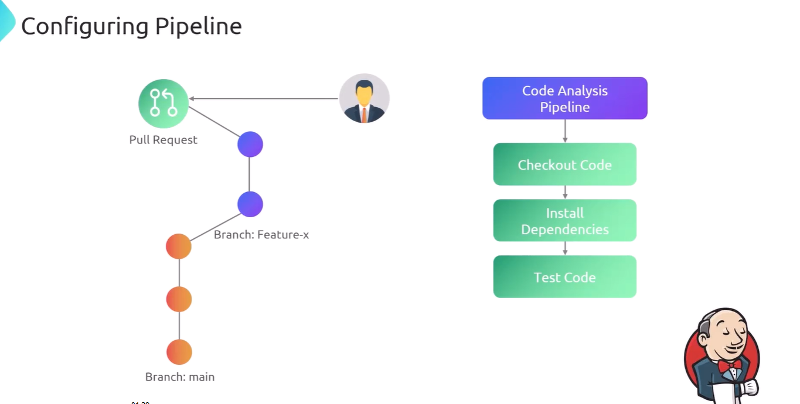

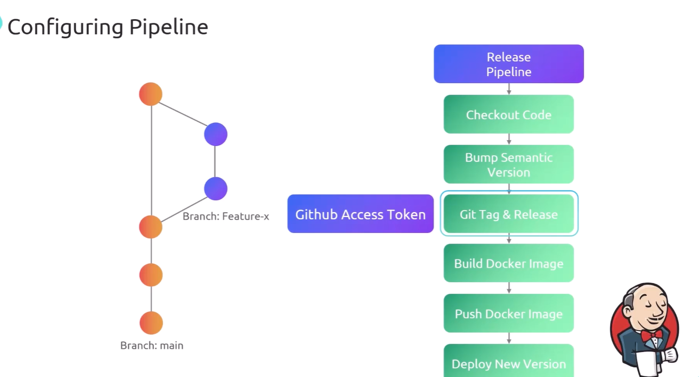

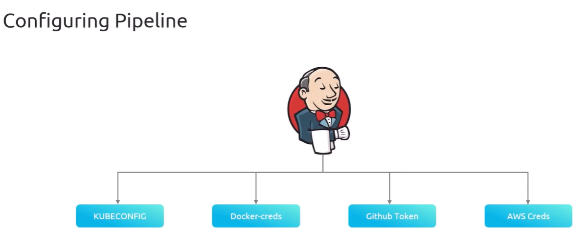
