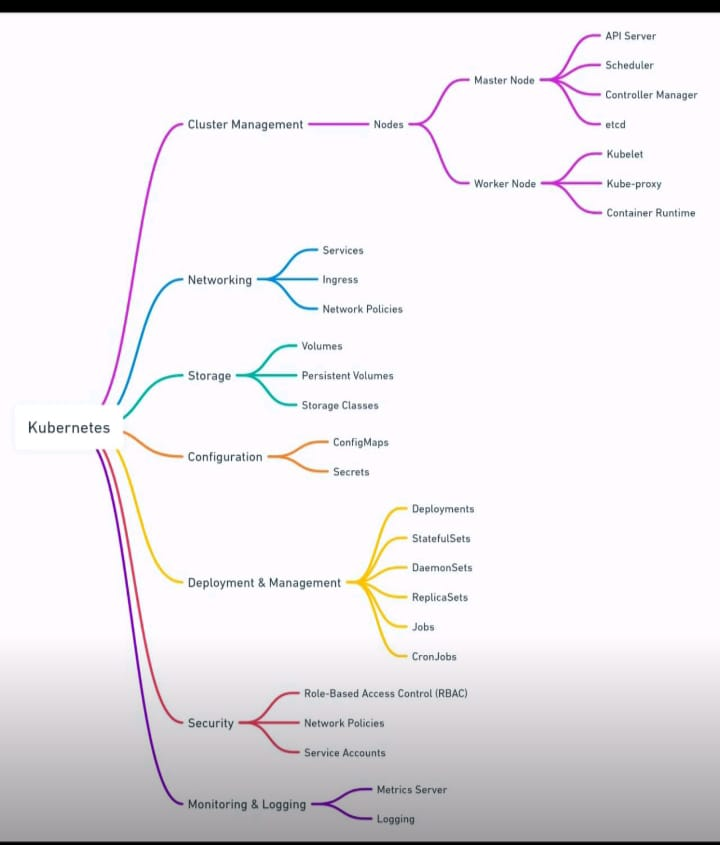
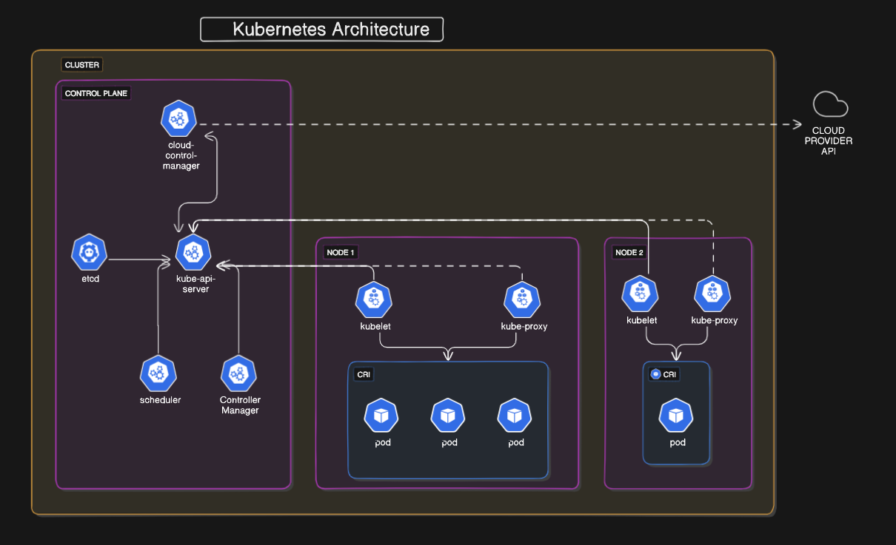
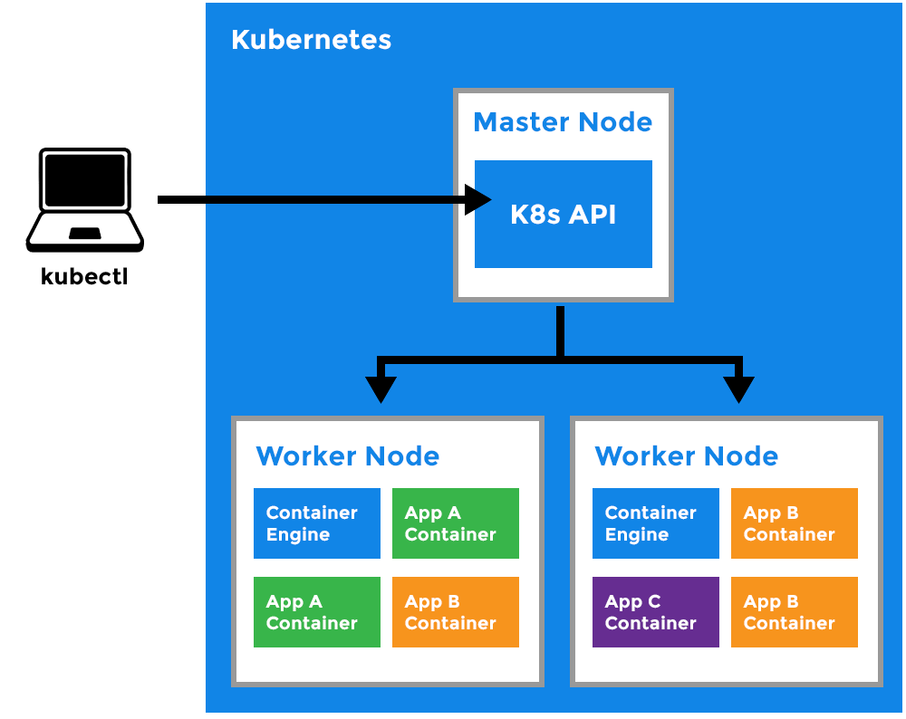

Content

[kubernetes Introduction]()
- Monolithic vs Microservices Architecture
- Features of Kubernetes
- Alternatives of K8s
- Docker swarm vs K8s
- Master-slave/ client-server architecture in kubernetes

[Kubernetes Architecture - Master Node]()
- API Server
- ETCD
- Controller Manager
- Scheduler
- Example

[Kubernetes Architecture - Worker node]()
- kubelet
- kube-proxy
- pods
- container engine
- Example

[Setting up minikube locally]()
- Pre-requisites
- HandsOn
- Creating your first pod
- Deploying the pod

[Kubeconfig, services deployment files]()
- kubeconfig files
- service files
- deployment files

[Deploying Nodejs application on kubernetes cluster]()

[kubernetes labels, selectors, and node selectors]()
- Labels
- Labels-selectors
- Node Selector

[ReplicationController & Replicaset]()
- ReplicationController
- ReplicaSet

[Deployment Object in Kubernetes]()
- use cases for deployment object

[Kubernetes cluster (master+workernode) using kubeadm on AWS]()
- Replication Controller
- Replicaset

[Kubernetes Networking (services)]()
- clusterIP
- Loadbalancer
- Nodeport
- ExternalName

[Kubernetes Advanced Networking(CNI and Calico)]()
- Alternatives of Calico CNI
- Key concepts and Real-time

[Kubernetes volumes and livenessprobes]()
- EmptyDir
- hostpath
- Persistent Volume
- persistent Volume claim (pvc)
- Liveness Probe (healthcheck)

[Kubenetes Configmaps & secrets]()
- configMaps
- CM from file
- CM from env file
- CM from yaml file
- secrets
- creating secrets from literal
- Secrets from file
- secrets from the env file
- CM from the yaml file

[Kubernetes jobs]()
- use cases
- Key-features

[Kubernetes INITcontainer]()
- Use cases

[Kubernetes pod lifecycle]()
- types of pod state

[Kubernetes namespace]()
- when we should consider kubernetes namespaces ?

[kubernetes ResourceQuota]()
- Limit & Request

[Kubernetes Autoscaling]()
- Types of autoscaling
- keyfeatures of Horizontal pod autoscalar

[Multi-cluster kubernetes with HAProxy]()
- HAproxy

[Kubernetes Ingress]()
- Path-based Routing
- Host-based Routing

[Kubernetes Statefulsets]()
- stateful vs stateless applications
- statefulsets vs deployment
- keyfeatures of statefulsets

[Kubernetes Daemonset]()
- Daemonset key features
- usecases

[Kubernetes network policies]()
- Network Policy
- Key Features
- use cases of network policy

[Kubernetes Operators]()
- what are operators
- Key features of operators: 1. Custom resource definition 2. custom controller 3. custom resource

[HELM & Helm charts]()
- helm 
- helm Deployment

[helm Project]()
- Deploy flask application using helm chart and other features

[AWS Elastic Kubernetes Services EKS]()
- what is AWS EKS
- Key features
- AWS EKS Costing

[Azure Kubernetes Service (AKS)]()
- What is AKS
- key features
- Azure AKS Costing

[Google Kubernetes Engine (GKE)]()
- What is GKE
- Key features

[End-To-End Devsecops Kubernetes Project]()
- Tools
- Github
- AWS (cloud)
- Jenkins
- prometheus, Node exporter, Grafana, Trivy, Sonarqube, OWASP, Kubernetes

## kubernetes Introduction
### what is Kubernetes ?

- Kubernetes also known as “K8s”, is an open-source container orchestration platform developed by google.
- It is designed to automate the deployment, scaling, and management of containerized applications across a cluster of nodes.
- Kubernetes provides a consistent and reliable way to manage applications, regardless of whether they are running on-premises, in the cloud or in the hybrid environments.

**Monolithic Architecture VS Microservices - Key differences**
- Monolithic architecture is like a single kitchen handling all tasks, while microservices
architecture is like multiple specialized restaurants working together.
- Monoliths are typically easier to set up and manage initially, while microservices offer
more flexibility and scalability.
- Monoliths can have a single point of failure, while microservices are more fault-tolerant
because a failure in one microservice doesn’t necessarily affect the others

********what is Microservices ?********

- Microservices are a software architecture pattern that structures applications as a collection of small, independently deployable services.
- Each microservice is designed to perform a specific function or business capability and communicates with other services over well-defined APIs or protocols.

why we need kubernetes and what it can do ?

1. simplify container management
2. Enhance resilencey
3. Simplify application deployment
4. Improve scalability
5. Increase automation
6. provide flexibility

Features of Kubernetes :
- Autoscaling
- Autohealing
- LoadBalancing
- Platform Independent
- Fault Tolerance
- Rollback
- Health Monitoring of containers
- Orchestration

Alternatives of Kubernetes:
- Docker Swarm
- Apache Mesos
- Openshift
- Nomad

Differences between Docker Swarm and Kubernetes 

Docker Swarm vs Kubernetes 

|context |Docker Swarm| Kubernetes| 
|---|---|---|
|Install and Configurations|quick easy and fast| complicated and time consuming|
|supports|only work with docker containers|can work with any other containers such as docker, containerd , etc|
|Data Volumes|can be shared with any other containers|can be shared to the same pod's containers|
|GUI|Not supported|Supported|
|Autoscaling|Not supported|Supported|

## Kubernetes Architecture - Master Node

**************************************************Kubernetes Architecture :**************************************************

A cluster contains master node and worker nodes.

Master node/control plane is the brain of the cluster.

- A master can be a VM/EC2 instance/virtual box/physical machine/on-premises
- It contains 4 components
    - API Server
    - Controller Manager
    - Scheduler
    - ETCD

******API Server :******

- The API server is a component of the kubernetes control plane that exposes the kubernetes API. The API server is the front end for the kubernetes control plane.

********************Scheduler :********************

- Control plane component that watches for newly created pods with no assigned node and selects a node for them to run on.

****************************************Controller Manager :****************************************

- Control Plane component that runs controller processes

********************************ETCD Database :******************************** 

- consistent and highly available key value store used as kubernetes backing  store for all cluster data.

## Kubernetes Architecture - Worker node
**Worker Node Component**

******************************kubelet :****************************** 

- An agent that runs on each node in the cluster. It make sure that containers are running in a pod.
- the Kubelet takes a set of PodSpecs that are provided through various mechanisms and ensures that the containers described in those podspecs are running and healthy. The kubelet doesn’t manage containers which were not created by Kubernetes.

**************************Kube-proxy :**************************  

- kube proxy is a network proxy that runs on each node in cluster, implementing part of the kubernetes service concept.
- Kubeproxy maintains network rules on nodes. These network rules allow network communication to your pods from network sessions inside or outside of your cluster.

container platform : 

******************************************workload components :******************************************

pods

Deployments

Services

Ingress

ConfigMaps

Secrets

Namespaces

Persistent Volumes

Persistent Volume Claims

Statefulsets and more

**********pod :**********

- In kubernetes, “pod” is the smallest and most basic unit of deployment
- It represents a single instance of running process within the cluster.
- A pod encapsulates one or more containers, storage resources, network configurations, and other options required to run a specific set of containers together.
- pods are typically created and managed using higher-level abstractions such as Deployments, Replicasets or statefulsets, which provide additional features like scaling, rolling updates, and self-healing capabilities.
- Pods provide several benefits, include resource isolation, flexible deployment strategies, easy scaling and enhanced Reliability.
- 

[Troubleshooting](https://www.prodevopsguy.site/100-Kubernetes-Errors-With-Solution)

## Setting up minikube locally
##  Kubeconfig, services deployment files
##  Deploying Nodejs application on kubernetes cluster
##  kubernetes labels, selectors, and node selectors
##  ReplicationController & Replicaset
##  Deployment Object in Kubernetes
##  Kubernetes cluster (master+workernode) using kubeadm on AWS
##  Kubernetes Networking (services

## Kubernetes Advanced Networking(CNI and Calico)
## Kubernetes volumes and livenessprobes
## Kubernetes volumes and livenessprobes
## Kubernetes jobs

## Kubernetes INITcontainer

## Kubernetes pod lifecycle

## Kubernetes namespace

## kubernetes ResourceQuota

## Kubernetes Autoscaling

## Multi-cluster kubernetes with HAProxy

## Kubernetes Ingress

## Kubernetes Statefulsets

## Kubernetes Daemonset

## Kubernetes network policies

## Kubernetes Operators

## HELM & Helm charts

## helm Project

## AWS Elastic Kubernetes Services EKS

## Azure Kubernetes Service (AKS)

## Google Kubernetes Engine (GKE)

## End-To-End Devsecops Kubernetes Project
