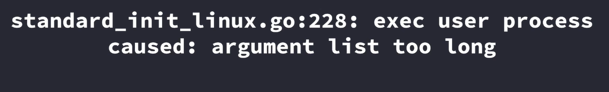
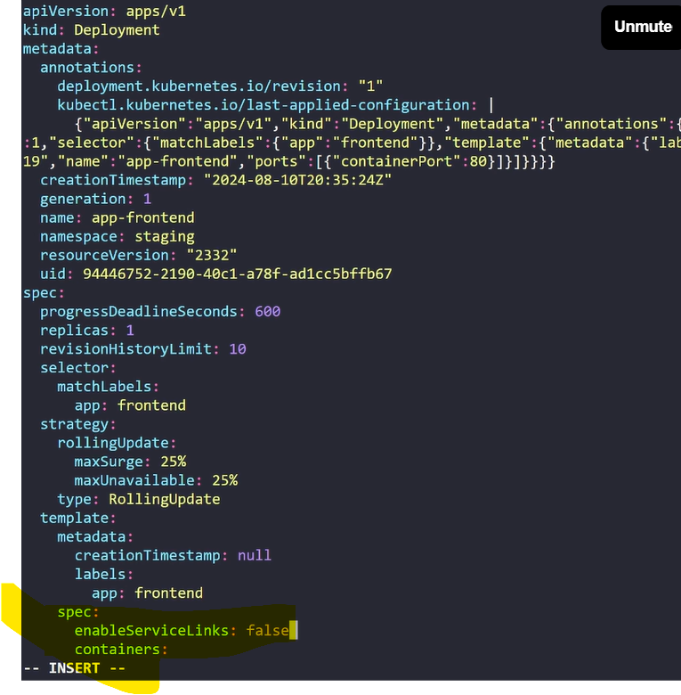

alias k=kubectl 

k get all -> to see all resources

k get all -A -> To see all resources in all namespaces in the cluster

k get ns -> to get ns

k get deploy -n <ns>

k get deploy -n <ns> -o yaml -> to get complete info about deployment

k get deploy -n <ns> -o yaml | grep <resource>

k get deploy -n <ns> -o=jsonpath='{.spec.replicas}'

k get deploy -n <ns> -o=jsonpath='{.spec.template.spec.containers}'

## kubectl describe

- k get nodes

- k describe node <name>

- k describe -n <ns> pod/<name>

## kubectl get events

- k get events -n <ns>

## kubectl logs

- k logs -n <ns> <resource-name>

- k logs -n <ns> <resource-name> --all-containers

- k get pods

- k logs <pod-name> -c <container-name>

## kubectl logs --label

- k get deployment -n <name> -o yaml | grep labels -A5

- k logs -n <ns> -l app=notes.app (ex: took here)

## k logs --timestamps

- k logs -n <ns> <resource-name> --timestamps

- k logs logs-generator --since=5s

## k logs --follow

- k logs logs-generator -f --> for continuous realtime log generation

## kubectl exec

- k exec -n <ns> -c <container-name>

- k exec -n <ns> <rs> -- ls

- k exec -n <ns> <rs> -- cat <path>

- k exec -n <ns> <rs> -it -- /bin/bash

## kubectl port-forward

- k get svc -A

- k port-forward -n <ns> svc/<rs-name> <localport>:<service port> 

## kubectl auth can-i

- k auth can-i <verb ex:list/get/update> <resource name EX; pod> -n <ns>

- k auth whoami

- k get roles

- k get role pod-reader -o yaml

- k get rolebindings

- k get rolebinding read-pods -o yaml

- k auth can-i get pods --as=charan

- k auth can-i delete pods --as=charan

- k auth can-i get pods --as=system:serviceaccount:default:default

## kubectl top

- k get pods -n <ns>

- k top pods -n <ns>

- k get nodes

- k get nodes -o wide

- k top nodes

## kubectl explain

- k explain pods

- k explain pods.spec

- k explain pods.spec.securitycontext --recursive

## kubectl diff

- k get deployments -n redis

- k diff -f <filename>

## kubectl debug

why debug instead of exec
- to minimize pod disruptions
- distroless images (too lightweight images for good security practice)
- crashed container

- k debug <name of pod> -it --image=busybox

- k apply -f nginx.yml

- k debug -it nginx-pod --image=busybox

- k debug -it nginx-pod --image=busybox --target=nginx

- k debug nginx-pod --image=busybox -it --copy-to-debugging-pod --share-processes

## Image pullBackoff Errors
- Even though, if we are able to see image pullbackoff error, it doesn't mean that we are having same issue for all.

## Crashing pods
- It is not an error, but it is a looping of container . Meaning a container inside a pod is trying to come live but it failed and starts restarting and this happening continuously.

default restart policy in the k8s manifest file is `Always`.

## Pending pods

- k8s receive request to schedule a pod but it's not able to in the any of the node in the cluster due to many reasons like cpu,memo
limits does not involve in scheduling part 

`kubectl label nodes node01 type=gpu`

taints, tolerations, insufficient resources, nodeselector/missing label, affinity, antiaffinity will be some of the reason for the pods to be in pending state.

## Case of the Missing Pods

- Resource quota limits, any dependency missing of the pod like service account, To know more details about it always try to check at events of the pods.

## Schrodinger's Deployment
- key considerations when it comes to schrodinger's deployment is `endpoints application, service load balancing, label selector matching`

## Create a container error

1. Pull Image

2. Generate Container
Configuration

CreateContainerConfigError

3. Create Container

CreateContainerError

4. Start Container

RunContainerError

## config out of date

## Reloader
- Reloader is an external feature in k8s which will helpus to keep track of any chances made to configmaps, secrets etc in our kubernetes clsuter resources.

- How to setup and more details about it can be found on the github at `https://github.com/stakater/Reloader`

## Endlessly Terminating Pods

-  use --force at the end of the kubectl command

## Field immutability
delete the paritcular resource/object where we are getting this kind of error and recreate it again with the same manifest file. It will work.

- The reason for being like this is that may be due to static type nature of some of the things in manifest file like matchlables etc

## Enable servicelink
- 
enable servicelink is true by default

## Interns can see our secret (RBAC Troubleshooting)

using RBAC
k auth can i get access like this commands

## Port mania
- We just have to make sure the target port in service manifest file and container port on deployment manifest file should be same.

## unreachable pods + Leaky network policies

## what is ingress ?

## Multi-attach volume errors (storage)

