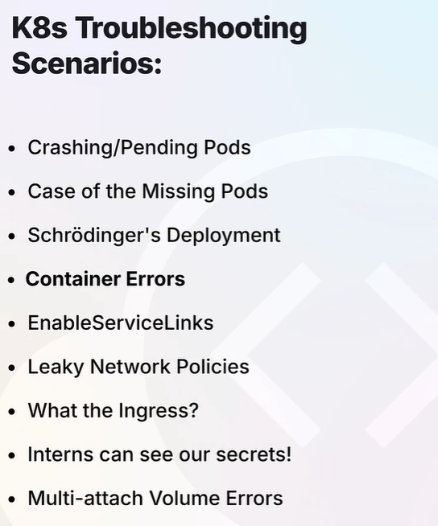
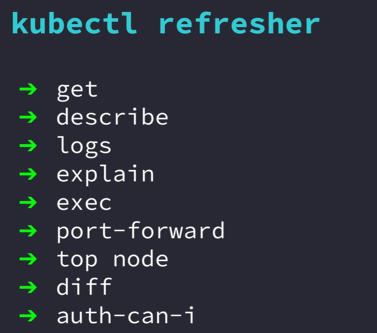

alias k=kubectl 

k get all -> to see all resources

k get all -A -> To see all resources in all namespaces in the cluster

k get ns -> to get ns

k get deploy -n <ns>

k get deploy -n <ns> -o yaml -> to get complete info about deployment

k get deploy -n <ns> -o yaml | grep <resource>

k get deploy -n <ns> -o=jsonpath='{.spec.replicas}'

k get deploy -n <ns> -o=jsonpath='{.spec.template.spec.containers}'

## kubectl describe

- k get nodes

- k describe node <name>

- k describe -n <ns> pod/<name>

## kubectl get events

- k get events -n <ns>

## kubectl logs

- k logs -n <ns> <resource-name>

- k logs -n <ns> <resource-name> --all-containers

- k get pods

- k logs <pod-name> -c <container-name>

## kubectl logs --label

- k get deployment -n <name> -o yaml | grep labels -A5

- k logs -n <ns> -l app=notes.app (ex: took here)

## k logs --timestamps

- k logs -n <ns> <resource-name> --timestamps

- k logs logs-generator --since=5s

## k logs --follow

- k logs logs-generator -f --> for continuous realtime log generation

## kubectl exec

- k exec -n <ns> -c <container-name>

- k exec -n <ns> <rs> -- ls

- k exec -n <ns> <rs> -- cat <path>

- k exec -n <ns> <rs> -it -- /bin/bash

## kubectl port-forward

- k get svc -A

- k port-forward -n <ns> svc/<rs-name> <localport>:<service port> 

## kubectl auth can-i

- k auth can-i <verb ex:list/get/update> <resource name EX; pod> -n <ns>

- k auth whoami

- k get roles

- k get role pod-reader -o yaml

- k get rolebindings

- k get rolebinding read-pods -o yaml

- k auth can-i get pods --as=charan

- k auth can-i delete pods --as=charan

- k auth can-i get pods --as=system:serviceaccount:default:default

## kubectl top

- k get pods -n <ns>

- k top pods -n <ns>

- k get nodes

- k get nodes -o wide

- k top nodes

## kubectl explain

- k explain pods

- k explain pods.spec

- k explain pods.spec.securitycontext --recursive

## kubectl diff

- k get deployments -n redis

- k diff -f <filename>

## kubectl debug

- 