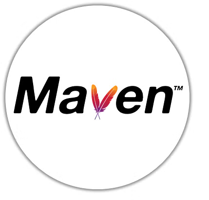
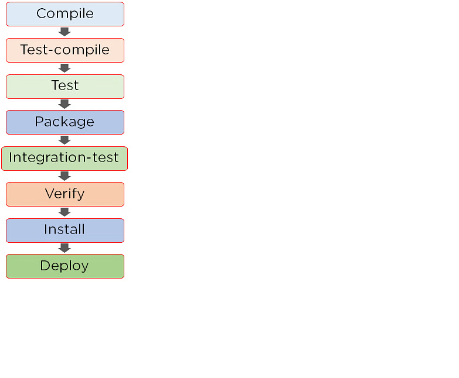

[Learning Source](https://www.youtube.com/watch?v=INCq-6B_Heg&list=PLS1QulWo1RIaaQ3mAU9Nj4rqfwbAv3wIZ&index=28)



Topics
# What is maven


## what is maven ?

- Maven is a software project management build tool based on Project Object Model (POM). The tool is typically used for Java-based projects. Every Java project requires certain dependencies, which are automatically downloaded when running a Maven build. This simplifies everyday tasks for Java developers and helps them with their projects.

- Maven helps retrieve the correct JAR files for each project, as there may be different versions of separate packages. If you want to download dependencies, you no longer need to visit each software's official website. It can be quickly done now by visiting "mvnrepository.com."

- Maven is based on Project Object Model (POM) and focuses on simplification and standardization of the building process

- Maven uses a declarative approach to configuration and relies on XML files called "pom.xml" to describe the project's structure, dependencies, and build process.

- It also offers a vast repository of opensource libraries and plugins that can be easily integrated into projects .


During the process, Maven takes care of the following elements:

```
Builds
Dependencies
Reports 
Distribution
Releases
Mailing list
```

### what is build tool

- A build tool is essential for the process of building, as these are the tools that automate the process of creating applications from the source code. The build tool compiles and packages the code into an executable form.

A build tool does the following tasks:

```
Generates source code
Generates documentation from the source code
Compiles source code
Packages the compiled codes into JAR files
Installs the packaged code in the local repository, server, or central repository
```

## what is maven repository

- Maven repositories refer to the directories of packaged JAR files that contain metadata. The metadata refers to the POM files relevant to each project. This metadata is what enables Maven to download dependencies

There are 3 types of repositories.

1. Local Repository `Local repository refers to the developer’s machine, which is where all the project material is saved. This repository contains all the dependency jars`

2. Remote Repository `Organization owned custom repository`

3. Central Repository `Repository provided by Maven community`

Maven searches for the dependencies in the following order:
```
Local repository -> Central repository -> Remote repository.
```

### why Maven uses convention and not configuration

- Convention is used when the developers are not required to create the build processes. The users do not have to specify the configurations in detail, and once the project is created, it will automatically create a structure. With configuration, on the other hand, developers are supposed to create the build processes manually.

- Maven uses convention over configuration so developers just have to create a Maven project. The rest of the structure is automatically generated. There are many conventions present in Maven for setting up a plan, building the artifacts, releasing the code, and running unit tests. The developer simply places the files, and there is no need to define any configuration in pom.xml. 

- The feature helps developers to freely build any Maven project without worrying about the need to know about the workings of each plugin. The Maven plugins look over the project management and build-related works.

Below are the primary and significant concepts of Maven:
```
1.Project Object Model
2.Dependencies and repositories
3.Build life cycles, phases and goals
4.Build profiles
5.Build plugins
```

**1. Project Object Model (POM)**
- Project Object Model (POM) refers to the XML files with all the information regarding project and configuration details
- It contains the project description, as well as details regarding the versioning and configuration management of the project
- The XML file is in the project home directory. Maven searches for the POM in the current directory when any given task needs to be executed

**2. Dependencies and Repositories**
- Dependencies refer to the Java libraries required for the project. Repositories refer to the directories of packaged JAR files.
- If the dependencies are not present in your local repository, then Maven downloads them from a central repository and stores them in the local repository

**3. Build Life Cycles, Phases and Goals**
- This consists of a sequence of build phases, and each build phase consists of a series of goals
- Each goal is responsible for a particular task
- When a process is executed, all purposes related to that phase and its plugins are also compiled

**4. Build Profiles**
- This refers to the set of configuration values required to build a project using different configurations
Different build profiles are added to the POM files when enabling different builds
- A build profile helps in customizing the build for different environments

**5. Build Plugins**
- A Maven plugin refers to the group of goals that may or may not be in the same phase
- The plugins are used to perform a specific goal
- Maven has its standard plugins that can be used. If desired, users can also implement their own in Java

## features of Maven

Apache Maven manages all the processes, like building, documentation, releasing, and distribution in project management.

- The tool simplifies the way of project building by increasing the performance of the project and the building process
- The task of downloading dependencies and JAR files is automated
- Maven provides easy access to all necessary information
- Maven makes it simple for the developer to build a project in different environments without worrying about the dependencies, processes, etc.
- In Maven, it is simple to add new dependencies—you only have to write the dependency code in the POM file

## Maven Architecture
- The projects created in Maven contain POM files that describe the aspect of the project essentials. 
- Maven architecture shows the process of creating and generating a report according to the requirements and executing lifecycles, phases, goals, plugins, and so on—from the first step. 


#### How Does the Maven Architecture Work?

- The first step refers to configuring Maven, which is stored in a pom.xml.file. The POM file includes all of the configurations that Maven needs. 
- The second step is to download the dependencies defined in pom.xml into the local repository from the central repository
- After the user starts working in Maven, the tool provides various default settings, so there is no need to add every configuration in the pom.xml

## Maven Build Lifecycle

- The Maven build life cycle is a sequence of steps that need to be followed in order to build a project, which eventually helps to execute goals. 

The following are the phases of the build life cycle:



There are 3 types of standard lifecycles:

1. Default
```
The default or build life cycle is the primary cycle that is responsible for building the application. There are 21 different phases in this primary life cycle, starting from the process of validation to the step of deployment
```
2. Clean
```
The clean life cycle handles project cleaning. The clean phase consists of the following three steps: 

- Pre-clean
- Clean
- Post-clean

The mvn post-clean command is used to invoke the clean lifestyle phases in Maven
```

3. Site
```
The Maven site plugin handles the project site's documentation, which is used to create reports, deploy sites, etc. 

The phase has four different stages: 

- Pre-site
- Site 
- Post-site 
- Site-deploy

Ultimately, the site that is created contains the project report.

```

## Creating your first project using Maven

1. Inside the terminal, check the version `$ mvn --version`

2. Now, let's run the below commands
```
mvn archetype : generate

mkdir temp

cd temp
```

3. Follow the prompt
```
Maven will then have the user choose a number or version.

- You can select any number:
    We have selected the number five
Maven will prompt the user for a group:
    com.devopsdelight
Maven will prompt the user for an artifactI:
    sampleproject
The version remains the same
The package also remains the same 
Enter Y for yes
Press enter
```

4. The sample project will be created with the artifactId you have provided and go inside the directory to verify the files that are created

```
cd sampleproject

ls -alrt

cat pom.xml

vi pom.xml
```

When the pom.xml file is opened, you can see the attributes on the screen. It shows the groupId, artifactId, the JAR file, and the version. You can also add your own custom dependencies.

If you run the clean command, it will be classified as a Maven project.

`mvn clean install`

- A pom.xml file is already present in the local repository. The execution of the steps will take place accordingly.

- Eventually, you can see a couple of JAR files being created in the directory

- You can create a new project with this method, and based on our understanding, amendments can be made in the dependencies. Hence, a required final result can be obtained
<br></br>

[Download Maven](https://maven.apache.org/download.cgi)

[Click me to learn more about Maven](https://maven.apache.org/guides/getting-started/index.html)


if you like the topics, consider ⭐ the repo to get further updates.