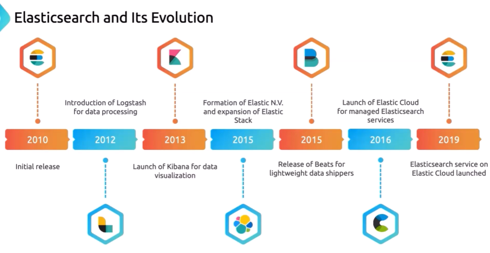
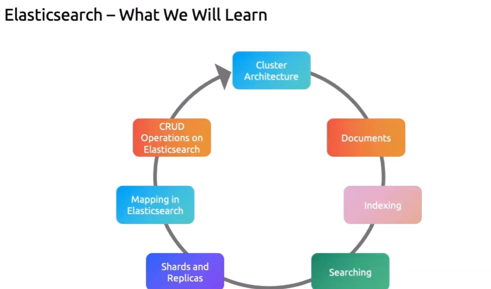

Repo : https://github.com/kodekloudhub/efk-stack

1. what is logging and elastic search

2. Mastering Elastic search fundamentals

3. Understanding kibana

4. Fluent Bit

5. Elastic search and kibana deployment on kubernetes

6. Deploying E-commerce application on k8s

7. Instrumenting a simple python app for logging

8. Elstic cloud

### 1.

what is logging and why does it matter ?

> LOGGING  is a critical aspect of modern physical infrastructure providing essential 

