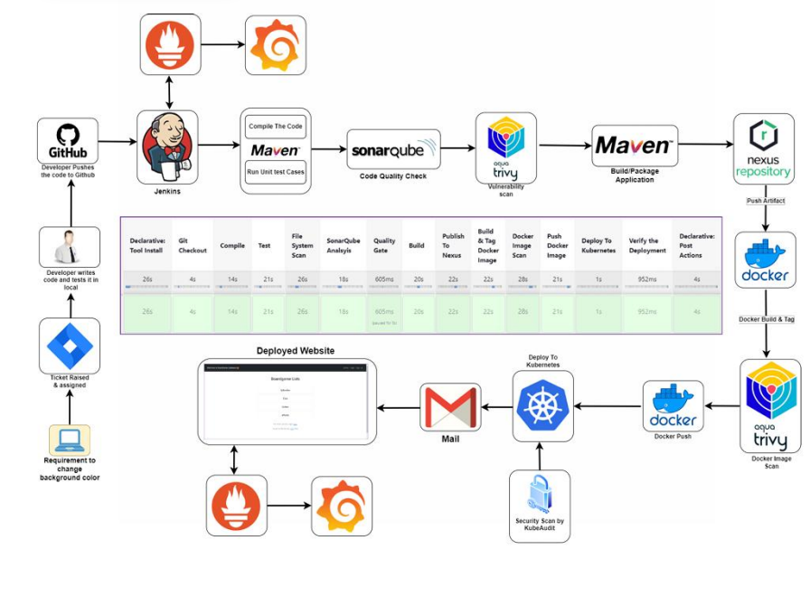

# Introduction
- In the rapidly evolving landscape of software development, the adoption of DevOps practices
has become imperative for organizations striving for agility, efficiency, and quality in their
software delivery processes. The project at hand focuses on the implementation of a robust
DevOps Continuous Integration/Continuous Deployment (CI/CD) pipeline, orchestrated by
Jenkins, to streamline the development, testing, and deployment phases of a software product.

- In the 
# Architecture

# Purpose and Objectives

The primary purpose of this project is to automate the softwware delivery lifecycle from code compilation to deployment threreby accelerating time-to-market, enhancing product quality, and reducing manual errors. The key objectives include

- Establishing seamless CI/CD pipeling using jenkins to automate various stages of the software delivery process.
- Integrating essential devops tools such as Maven, Sonarqube, trivy, Nexus Repository. docker, kubernetes, prometheus and grafana to ensure comprehensive automation and monitoring.
- Improving code quality through static code analysis and vulnerability scanning.
- Ensuring reliable and consistent deployments on kubernetes cluster with proper loadbalancing
- facilitating timely notification and alerts via email integration for efficient communication and incident management
- Implementing robust monitoring and alerting mechanisms to track system health and performance

  
# Tools Used

jenkins - Automation orchestration for CI/CD Pipeline
maven  - Build automation and dependency management
Sonarqube - static code analysis for quality assurance
Trivy - Vulnerability scanning for Docker images
Nexus Repository - Artifact management and version control
Docker - Containeerization for consistency and portability
kubernetes - Container orchestration for deployment
Gmail Integration - Email notifications for pipeline status
Prometheus and Grafana - Monitoring and visualization of system metrics 
AWS - Creating virtual machines

1. [VirtualMachines-Setup](./VirtualMachines-setup.md)

  - [K8s-setup](./settingup-K8s-cluster-using-kubeadm.md)

  - [Jenkins & Docker Installation](./JenkinsandDocker-Installation.md)

  - [Nexus-setup](./Nexus-setup.md)

  - [Sonarqube-setup](./sonarqube-setup.md)

2.  [Git Repository setup](./GitRepositorysetup.md)

3. [CI-CD setup](./CI-CD.md)

4. [Monitoring](./Monitoring.md)

5. [Results](./Results.md)

# conclusion
- In conclusion, The successful implementation of the DevOps CI/CD pipeline project marks a significant milestone in enhancing the efficiency, reliability, and quality of software delivery processes. 
- By automating key aspects of the software development lifecycle, Including compilation, testing, deployment, and Monitoring the project has enabled rapid and consistent delivery of software releases, contributing to improved time-to-market and customer satisfaction.

# Acknowledgment of Contributions:

I would like to extend my gratitude to DevOps shack for helping me achieving my
goals and objectives. 

## Final Thoughts
Looking ahead, the project's impact extends beyond its immediate benefits, paving the way for continuous improvement and innovation in software
development practices. By embracing DevOps principles and leveraging cutting- edge tools and technologies, we have laid a solid foundation for future projects to build upon. The scalability, flexibility, and resilience of the CI/CD pipeline ensure its adaptability to evolving requirements and technological advancements, positioning our organization for long-term success in a competitive market landscape

## References

**offical Websites**
References
1. Jenkins Documentation:
[https://www.jenkins.io/doc/](https://www.jenkins.io/doc/)
2. Maven Documentation:
[https://maven.apache.org/guides/index.html](https://maven.apache.org/guides
/index.html)
3. SonarQube Documentation:
[https://docs.sonarqube.org/latest/](https://docs.sonarqube.org/latest/)
4. Trivy Documentation:
[https://github.com/aquasecurity/trivy](https://github.com/aquasecurity/trivy)
5. Nexus Repository Manager Documentation:
[https://help.sonatype.com/repomanager3](https://help.sonatype.com/repoman
ager3)
6. Docker Documentation: [https://docs.docker.com/](https://docs.docker.com/)
7. Kubernetes Documentation:
[https://kubernetes.io/docs/](https://kubernetes.io/docs/)
8. Prometheus Documentation:
[https://prometheus.io/docs/](https://prometheus.io/docs/)
9. Grafana Documentation:
[https://grafana.com/docs/](https://grafana.com/docs/)

These resources provided valuable insights, guidance, and support throughout the
project lifecycle, enabling us to achieve our goals effective

