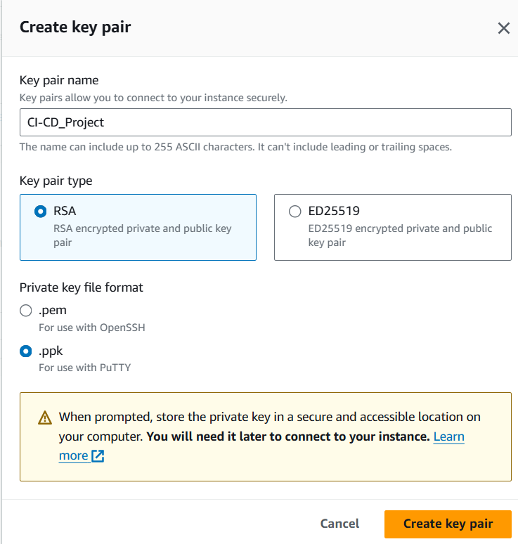
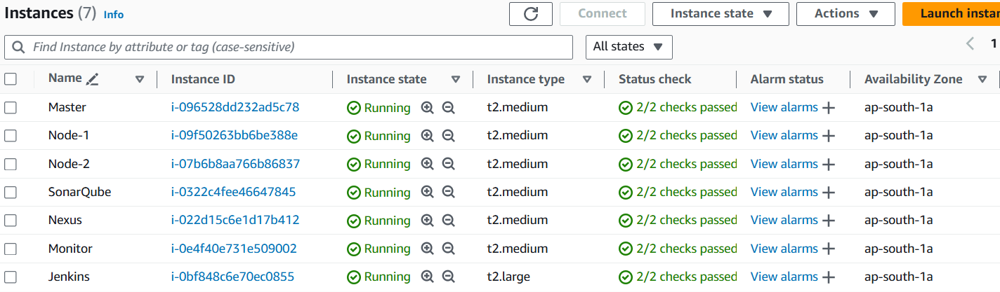

To establish the infrastructure required for the DevOps tool setup, virtual machines were provisioned on the AWS platform. Each virtual machine served a specific purpose in the CI/CD pipeline. Here's an overview of the virtual machines created for different tools.

1. **Kubernetes Master Node**: This VM served as the master node in the kubernetes cluster. It was  responsible for managing the cluster's state, scheduling applications, and coordinating communication between cluster nodes.

2. **Kubernetes worker node1 and Node2**: These virtual machines acted as  worker nodes in the kubernetes cluter,hosting and running containerized applications. They executed tasks assigned by the master node and provided resources for application deployment and scaling

3. **SonarQube Server**: A dedicated VM hosted the SonarQube server, which performed static code analysis to ensure code quality and identify potential issues such as bugs, code smells, and security vulnerabilities

4. **Nexus Repository Manager**: Another virtual machine hosted the Nexus Repository Manager. Serving as a centralized  repository for storing and managing build artifact, Docker images and other dependencies used in the CI/CD Pipeline

5. **Jenkins server**: A VM was allocated for the jenkins server, which served as the central hub for orchestrating the CI/CD Pipeline. jenkins coordinated the execution of pipeline stages, triggered build, and integrated with other DevOps Tools for seamless automation.

6. **Monitoring Server (prometheus and Grafana)**: A single vm hosted on both Prometheus and grafana for monitoring and visualization of system metrics. Prometheus collected metrics from various components of CI/CD Pipeline, while Grafana provided interface dashboards for real-time monitoring and analysis

- Each VM was configured with necessary resources including CPU, memory and storage to support the respective tool's functionalities and accomdate the workload demands of the CI/CD pipeline. Additionally security measures such as access controls , network configurations, and encryption were implemented to safeguard the virtualized infrastructure and dataintegrity .

### EC2 Instances

### Security Groups

